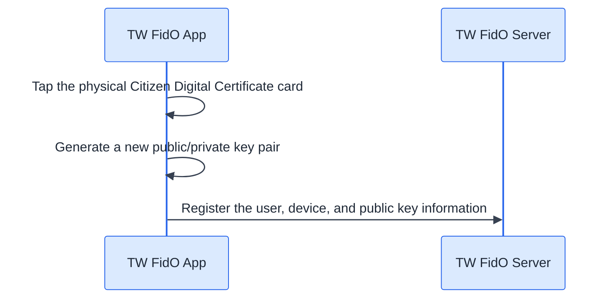
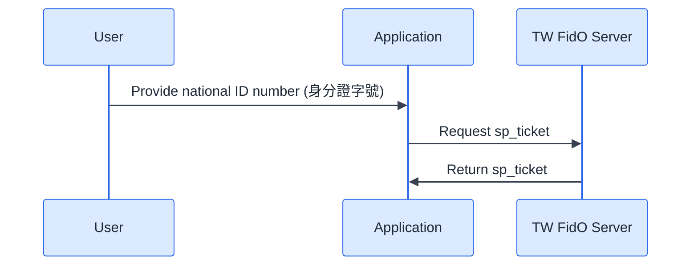
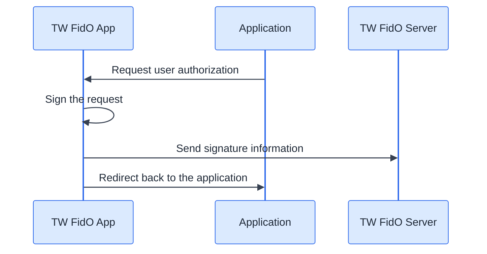
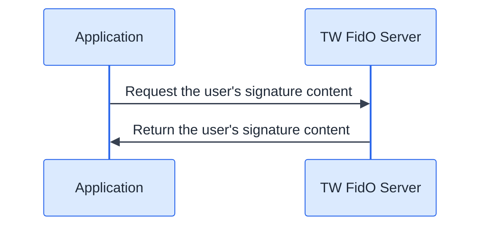
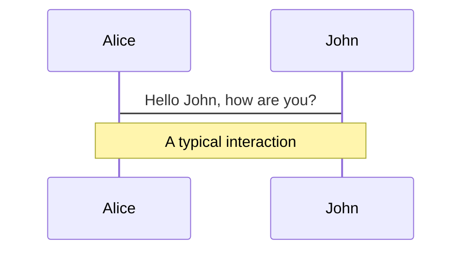
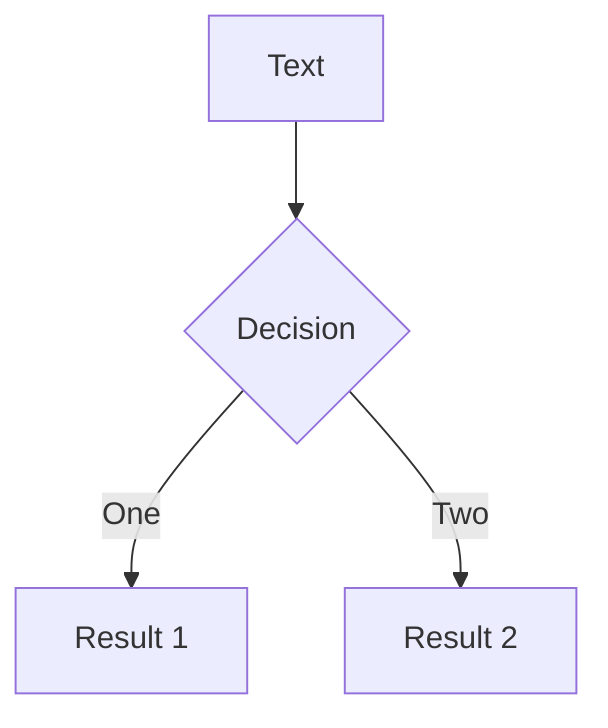
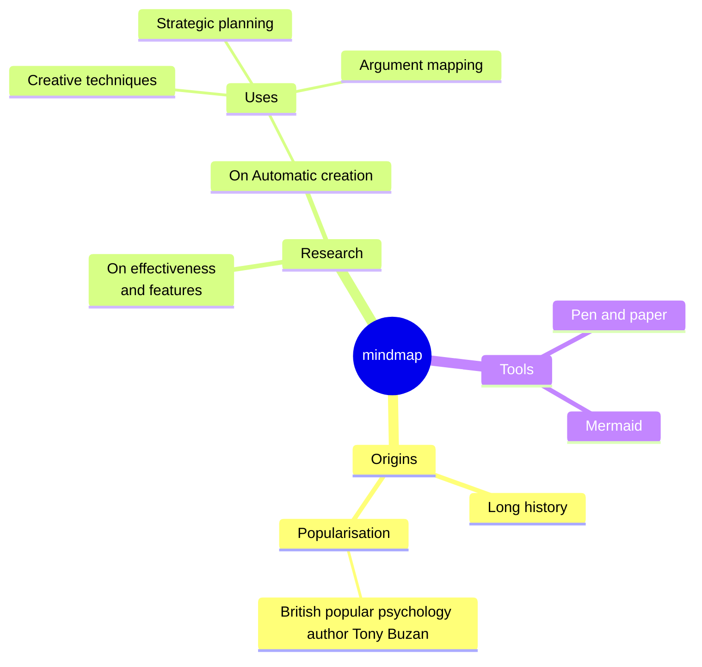
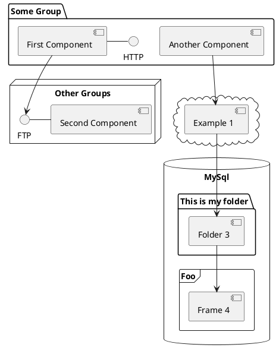

<div class="grid grid-cols-2 gap-8 items-center">
<div class="text-left">

# ZKP and<br/>Taiwan Citizen Digital Certificate

<br/>
<span class="text-white">Vivian (Ya-wen) Jeng</span>

</div>
<div class="flex flex-col items-center">
  
  <a href="https://linktr.ee/vivianjeng" target="_blank" class="mt-2 opacity-75">linktr.ee/vivianjeng</a>
</div>
</div>

<div class="abs-br m-6 text-xl">
  <button @click="$slidev.nav.openInEditor()" title="Open in Editor" class="slidev-icon-btn">
    <carbon:edit />
  </button>
  <a href="https://github.com/vivianjeng/2026-ethtaipei-zkfido" target="_blank" class="slidev-icon-btn">
    <carbon:logo-github />
  </a>
</div>

---
layout: two-cols
---

<div class="h-full flex flex-col justify-center pl-16">

# About Me
###  [Vivian (Ya-wen) Jeng](https://github.com/vivianjeng)

**2021 - 2026 June**

- **Ethereum Foundation** <br/>[Privacy Stewards of Ethereum](http://pse.dev/)
- Developer and project lead
    - [MoPro](https://zkmopro.org/) (Mobile Prover)
    - [UniRep](https://developer.unirep.io/) (Universal Reputation)

</div>

::right::

<div class="h-full flex items-center justify-center">
  
</div>


---
layout: image-right
image: /images/ptt_full.jpg
---

# Background

- 批踢踢實業坊(PTT): https://www.ptt.cc/bbs/index.html
<div class="flex flex-col gap-4 mt-6 text-sm">
  <div v-click.fade-in class="flex gap-3 items-start p-3 rounded border border-primary/20 bg-primary/10">
    <div>
      <div class="opacity-75">In 1995 <br/>— before social media existed —<br/> it was built by students</div>
    </div>
  </div>
  <div v-click.fade-in class="flex gap-3 items-start p-3 rounded border border-primary/30 bg-primary/15">
    <div>
      <div class="opacity-75">Approximately <b>30,000</b> daily active users</div>
    </div>
  </div>
  <div v-click.fade-in class="flex gap-3 items-start p-3 rounded border border-primary/40 bg-primary/20">
    <div>
      <div class="opacity-75">Non-profitable social media</div>
    </div>
  </div>
  <div v-click.fade-in class="flex gap-3 items-start p-3 rounded border border-primary/40 bg-primary/20">
    <div>
      <div class="opacity-75">Maintained by volunteers</div>
    </div>
  </div>
</div>

<style>
.slidev-layout.default + div {
  background-position: right center !important;
}
</style>


---
layout: two-cols
layoutClass: gap-8
---

# Problem

<div class="mt-6">
  <h2 class="text-lg font-semibold leading-tight flex items-center gap-2"><carbon:warning-alt class="text-yellow-400 text-xl" /> School email registration</h2>
  <div class="flex flex-col gap-3 mt-4">
    <div v-click class="bg-gray-50 rounded-xl border-2 border-gray-300 p-4 flex items-center gap-4">
      <carbon:user-multiple class="text-3xl text-red-400 shrink-0" />
      <div class="text-base">Previously targeted by hackers who <b>mass-registered accounts</b></div>
    </div>
    <div v-click class="bg-gray-50 rounded-xl border-2 border-gray-300 p-4 flex items-center gap-4">
      <carbon:bullhorn class="text-3xl text-red-400 shrink-0" />
      <div class="text-base">Also subject to <b>opinion manipulation and troll armies</b></div>
    </div>
  </div>
</div>

::right::

# Previous solution

<div class="mt-6">
  <h2 v-click class="text-lg font-semibold leading-tight flex items-center gap-2"><carbon:reset class="text-blue-400 text-xl" /> AOTP: Reverse OTP</h2>
  <div class="flex flex-col gap-3 mt-4">
    <div v-click class="bg-gray-50 rounded-xl border-2 border-gray-300 p-3">
      <div class="text-sm text-gray-500 mb-1.5">Traditional OTP</div>
      <div class="flex items-center gap-2 text-sm flex-wrap">
        <span class="inline-flex items-center gap-1.5 whitespace-nowrap"><carbon:email class="text-xl shrink-0" /> Telecom sends SMS</span>
        <carbon:arrow-right class="shrink-0 opacity-50" />
        <span class="inline-flex items-center gap-1.5 whitespace-nowrap"><carbon:password class="text-xl shrink-0" /> User enters it on the platform</span>
      </div>
    </div>
    <div v-click class="bg-gray-50 rounded-xl border-2 border-gray-300 p-3">
      <div class="text-sm text-gray-500 mb-1.5">AOTP</div>
      <div class="flex items-center gap-2 text-sm flex-wrap">
        <span class="inline-flex items-center gap-1.5 whitespace-nowrap"><carbon:security class="text-xl shrink-0" /> Platform displays a code</span>
        <carbon:arrow-right class="shrink-0 opacity-50" />
        <span class="inline-flex items-center gap-1.5 whitespace-nowrap"><carbon:mobile class="text-xl shrink-0" /> User sends it via SMS</span>
      </div>
    </div>
  </div>
  <div v-click class="absolute left-14 right-14 bottom-14 flex justify-center">
    
  </div>
</div>

<style>
.slidev-vclick-target {
  transition: opacity 400ms ease, transform 400ms ease;
}
.slidev-vclick-hidden {
  opacity: 0;
  transform: translateY(16px);
}
</style>

---
layout: center
---

# Why ZK?

---
layout: two-cols
---

# Cost

<div class="flex flex-col gap-3 mt-5 mr-3">
  <div v-click class="bg-gray-50 rounded-xl border-2 border-gray-300 p-4 flex items-center gap-4">
    <carbon:chart-line class="text-2xl text-red-400 shrink-0" />
    <div class="text-base">As a non-profit, more users means <b>higher costs, not more revenue</b></div>
  </div>
  <div v-click class="bg-gray-50 rounded-xl border-2 border-gray-300 p-4 flex items-center gap-4">
    <carbon:security class="text-2xl text-red-400 shrink-0" />
    <div class="text-base">Carries the <b>security risk of data breaches</b></div>
  </div>

</div>

::right::

# Privacy

<div class="flex flex-col gap-3 mt-5">
  <div v-click class="bg-gray-50 rounded-xl border-2 border-gray-300 p-4 flex items-center gap-4">
    <carbon:police class="text-2xl text-red-400 shrink-0" />
    <div class="text-base">When fraud or crime happens on the platform, the platform is required to <b>cooperate with investigations</b></div>
  </div>
  <div v-click class="bg-gray-50 rounded-xl border-2 border-gray-300 p-4 flex items-center gap-4">
    <carbon:warning-alt class="text-2xl text-red-400 shrink-0" />
    <div class="text-base">Complying means <b>handing over user data</b> — eroding user trust</div>
  </div>
</div>


<div class="absolute left-8 right-8 bottom-8 flex flex-col items-center gap-4">
  <div v-click class="flex justify-center quote-reveal">
    <div class="quote-box max-w-4xl w-full text-center rounded-xl border-2 px-10 py-7" style="border-color: var(--slidev-theme-primary); background: color-mix(in srgb, var(--slidev-theme-primary) 15%, transparent);">
      <p class="text-xl italic leading-relaxed" style="color: var(--slidev-theme-primary);">"PTT only needs users to prove they're Taiwanese —<br/> it doesn't need to know who they are."</p>
    </div>
  </div>

  <div v-click class="text-center text-base text-gray-700">
    This is exactly the use case <b>Zero-Knowledge Proofs</b> are perfect for<br/>PTT wouldn't need to rely on telecoms, nor store users' personal data
  </div>
</div>

<style>
.slidev-vclick-target {
  transition: opacity 400ms ease, transform 400ms ease;
}
.slidev-vclick-hidden {
  opacity: 0;
  transform: translateY(16px);
}
.quote-reveal.slidev-vclick-hidden {
  opacity: 0;
  transform: scale(0.7) rotate(-4deg) translateY(30px);
  filter: blur(6px);
}
.quote-reveal.slidev-vclick-target {
  transition: opacity 700ms ease, transform 700ms cubic-bezier(0.34, 1.56, 0.64, 1), filter 700ms ease;
}
.quote-reveal:not(.slidev-vclick-hidden) .quote-box {
  animation: quote-glow 2.4s ease-in-out infinite;
}
@keyframes quote-glow {
  0%, 100% { box-shadow: 0 0 0px 0px color-mix(in srgb, var(--slidev-theme-primary) 45%, transparent); }
  50% { box-shadow: 0 0 28px 6px color-mix(in srgb, var(--slidev-theme-primary) 45%, transparent); }
}
</style>

---

# ZK stack

<div class="grid grid-cols-2 gap-10 mt-6 divide-x divide-white/10">
<div class="pr-2">

<h2 class="text-xl font-semibold flex items-center gap-2"><carbon:certificate class="text-blue-400" /> <a href="https://github.com/privacy-ethereum/zkID" target="_blank">zkID</a></h2>

<div class="flex flex-col gap-3 mt-5">
  <div v-click class="bg-gray-50 rounded-xl border-2 border-gray-300 p-3 flex items-center gap-3">
    <carbon:certificate class="text-2xl text-blue-400 shrink-0" />
    <div class="text-base">In 2025, the zkID team published a paper introducing the <a href="https://eprint.iacr.org/2026/251.pdf" target="_blank"><b>OpenAC</b></a> mechanism</div>
  </div>
  <div v-click class="bg-gray-50 rounded-xl border-2 border-gray-300 p-3 flex items-center gap-3">
    <carbon:code class="text-2xl text-blue-400 shrink-0" />
    <div class="text-base"><a href="https://github.com/privacy-ethereum/zkID" target="_blank">Open-sources</a> the <a href="https://github.com/therealyingtong/Spartan2" target="_blank"><b>Spartan + Hyrax</b> Prover</a>, the core engine used to generate ZK proofs</div>
  </div>
  <div v-click class="bg-gray-50 rounded-xl border-2 border-gray-300 p-3 flex items-center gap-3">
    <carbon:unlocked class="text-2xl text-blue-400 shrink-0" />
    <div class="text-base">No <b>trusted setup</b> required, and integrates with the widely-used circom frontend</div>
  </div>
  <div v-click class="bg-gray-50 rounded-xl border-2 border-gray-300 p-3 flex items-center gap-3">
    <carbon:rocket class="text-2xl text-blue-400 shrink-0" />
    <div class="text-base">Excellent <b class="text-emerald-600">cross-platform</b> proving performance</div>
  </div>
</div>

</div>
<div class="pl-8">

<h2 class="text-xl font-semibold flex items-center gap-2"><carbon:mobile class="text-orange-400" /> <a href="https://github.com/zkmopro/mopro" target="_blank">mopro</a></h2>

<div class="flex flex-col gap-3 mt-5">
  <div v-click class="bg-gray-50 rounded-xl border-2 border-gray-300 p-3 flex items-center gap-3">
    <carbon:api class="text-2xl text-orange-400 shrink-0" />
    <div class="text-base">Provides <a href="https://zkmopro.org/docs/setup/rust-setup#-customize-the-bindings" target="_blank">customizable FFI</a>, with built-in support for <b>circom, halo2, noir</b></div>
  </div>
  <div v-click class="bg-gray-50 rounded-xl border-2 border-gray-300 p-3 flex items-center gap-3">
    <carbon:box class="text-2xl text-orange-400 shrink-0" />
    <div class="text-base">Freely import any Rust crate in <code>Cargo.toml</code> — integrating Spartan + Hyrax works just as well</div>
  </div>
  <div v-click class="bg-gray-50 rounded-xl border-2 border-gray-300 p-3 flex items-center gap-3">
    <carbon:devices class="text-2xl text-orange-400 shrink-0" />
    <div class="text-base"><a href="https://mozilla.github.io/uniffi-rs/latest/" target="_blank"><b>UniFFI</b></a> + <a href="https://crates.io/crates/mopro-cli" target="_blank">mopro CLI</a> auto-generate Swift / Kotlin / React Native / Flutter bindings</div>
  </div>
  <div v-click class="bg-gray-50 rounded-xl border-2 border-gray-300 p-3 flex items-center gap-3">
    <carbon:tools class="text-2xl text-orange-400 shrink-0" />
    <div class="text-base">Developers <b>no longer need to rewrite the Prover</b> for every language</div>
  </div>
</div>

</div>
</div>

<style>
.slidev-vclick-target {
  transition: opacity 400ms ease, transform 400ms ease;
}
.slidev-vclick-hidden {
  opacity: 0;
  transform: translateY(16px);
}
</style>

---

# Taiwan Citizen Digital Certificate

<div class="mt-2">
  <span class="text-sm px-3 py-1 rounded-full border" style="border-color: var(--slidev-theme-primary); color: var(--slidev-theme-primary);">X.509 Certificate · Supports both computer and mobile verification</span>
</div>

<!-- <div class="flex justify-center">
  
</div> -->

| Comparison | **Citizen Digital Certificate** | Passport | Digital Credential Wallet |
| --- | --- | --- | --- |
| Adoption | ~17–20% (4.18M active) | <span class="win">✅ ~60% (14M people)</span> | Early rollout, low coverage |
| Legal validity|<span class="win">✅ Legally binding — usable for e-signatures & gov services</span> | Travel document only, not for e-signing | Still evolving, unclear status |
| Revocability | <span class="win">✅ Real-time revocation check (CRL/OCSP), fast reissue</span> | 10-year validity, chip data not updated live | Depends on wallet's own update mechanism |
| Cross-platform| <span class="win">✅ Works with computer alone or mobile alone</span> | Needs phone + NFC scan | Needs a phone app | 
| User experience| <span class="win">✅ FIDO2 biometrics on mobile — no card, no password</span> | Physical passport + NFC tap | App-guided setup, unproven at scale|

<style>
.win {
  color:rgb(49, 101, 80);
  background: rgba(74, 222, 128, 0.28);
  padding: 2px 8px;
  border-radius: 6px;
  font-weight: 800;
}

table {
  width: 100%;
  margin-top: 1.5rem;
  border-collapse: collapse;
  font-size: 1rem;
}
th, td {
  padding: 10px 12px;
  text-align: left;
  vertical-align: top;
}
thead th {
  font-size: 0.8rem;
  text-transform: uppercase;
  letter-spacing: 0.05em;
  opacity: 0.6;
  font-weight: 600;
  border-bottom: 2px solid rgba(255, 255, 255, 0.2);
}
tbody td {
  border-bottom: 1px solid rgba(255, 255, 255, 0.08);
}
tbody tr:last-child td {
  border-bottom: none;
}
tbody tr:nth-child(even) {
  background: rgba(255, 255, 255, 0.03);
}
th:nth-child(2), td:nth-child(2) {
  background: color-mix(in srgb, var(--slidev-theme-primary) 10%, transparent);
  border-left: 1px solid var(--slidev-theme-primary);
  border-right: 1px solid var(--slidev-theme-primary);
}
</style>

---
layout: center
---

# ZK Circuit Design

---


# Verifying RSA Signatures

<div
  v-motion
  :initial="{ opacity: 0.7 }"
  :enter="{ opacity: 0.7 }"
  :click-1="{ opacity: 0 }"
  class="text-center mt-2 text-xl"
>PKCS#1 v1.5 signature: RSA signature algorithm paired with SHA-256 hashing</div>

<div class="flex justify-center mt-6">
  <div
    v-motion
    :initial="{ scale: 1, y: 0 }"
    :enter="{ scale: 1, y: 0 }"
    :click-1="{ scale: 0.5, y: -100 }"
    class="rounded-xl border-2 px-8 py-10 text-center"
    style="border-color: var(--slidev-theme-primary); background: color-mix(in srgb, var(--slidev-theme-primary) 10%, transparent); font-size: 1.25rem;"
  >

$$\underbrace{{\mathrm{signature}^{\,65537}}}_{\text{RSA signature}} \bmod \underbrace{n}_{\text{RSA modulus}} = \mathrm{Encoded\ Message}\Big(\mathrm{SHA{\text -}256}\big(\underbrace{M}_{\text{message to verify}}\big)\Big)$$

  </div>
</div>

<div
  v-motion
  :initial="{ opacity: 0.6 }"
  :enter="{ opacity: 0.6 }"
  :click-1="{ opacity: 0 }"
  class="text-center text-lg mt-2"
>e = 65537: fixed public exponent, the same for both government certificates and user signatures</div>

<div class="grid grid-rows-2 gap-3 mt-3 relative">
  <div 
    v-click="1" 
    v-motion
    :click-1="{ y: -185 }"
    class="bg-blue-400/10 backdrop-blur rounded-xl border-2 border-blue-400/40 p-4">
    <div class="flex items-center gap-1 ">
      <carbon:certificate-check class="text-xl text-blue-400 shrink-0" />
      <span class="text-base font-bold">Verify government signature</span>
    </div>
    <div class="text-sm mt-2 font-semibold text-green-600">Proves the Citizen Digital Certificate was issued by the government</div>
    <div class="font-mono text-sm mt-3 flex flex-col gap-1.5">
      <div>n = n<sub>issuer</sub> (2048 / 4096-bit) — Ministry of the Interior's public key</div>
      <div>M = M<sub>cert</sub> (the user's X.509 certificate)</div>
    </div>
  </div>
  <div 
    v-click="2"
    v-motion
    :click-1="{ y: -185 }"
    class="bg-orange-400/10 backdrop-blur rounded-xl border-2 border-orange-400/40 p-4">
    <div class="flex items-center gap-1">
      <carbon:checkmark-filled class="text-xl text-orange-400 shrink-0" />
      <span class="text-base font-bold">Verify user signature</span>
    </div>
    <div class="text-sm mt-2 font-semibold text-green-600">Ensures the user owns the certificate</div>
    <div class="font-mono text-sm mt-3 flex flex-col gap-1.5">
      <div>n = n<sub>user</sub> (2048-bit) — the user's public key</div>
      <div>M = designated message (provided by the platform)</div>
    </div>
  </div>
</div>

<style>
.slidev-vclick-target {
  transition: opacity 400ms ease, transform 400ms ease;
}
.slidev-vclick-hidden {
  opacity: 0;
  transform: translateY(16px);
}
</style>


---

# ZK Circuit: Verification Flow

<div class="flex items-start justify-center mt-8">
  <div class="relative flex flex-col gap-3 text-lg text-right mt-18 pl-10">
    <div class="flex items-center justify-end text-blue-600">*Issuer RSA public key <span class="arrow-line w-28 ml-2 -mr-6"></span></div>
    <div class="flex items-center justify-end text-gray-500">Issuer RSA signature <span class="arrow-line w-28 ml-2 -mr-6"></span></div>
    <div class="flex items-center justify-end text-gray-500"><span v-motion class="rounded-full px-2 py-0.5 border-2" :initial="{ color: '#6b7280', borderColor: 'transparent' }" :enter="{ color: '#6b7280', borderColor: 'transparent' }" :click-2="{ color: '#ef4444', borderColor: '#ef4444' }">User X.509 cert (TBS)</span> <span class="arrow-line w-28 ml-2 -mr-6"></span></div>
    <div v-click="2" class="flex items-center justify-end text-red-600 -translate-x-53">Contains</div>
    <div class="flex items-center justify-end text-gray-500"><span v-motion class="rounded-full px-2 py-0.5 border-2" :initial="{ color: '#6b7280', borderColor: 'transparent' }" :enter="{ color: '#6b7280', borderColor: 'transparent' }" :click-2="{ color: '#ef4444', borderColor: '#ef4444' }">User RSA public key</span> <span class="arrow-line w-28 ml-2 -mr-6"></span></div>
    <div class="flex items-center justify-end text-gray-500">User RSA signature <span class="arrow-line w-28 ml-2 -mr-6"></span></div>
    <div class="flex items-center justify-end text-blue-600">*Message (TBS) <span class="arrow-line w-28 ml-2 -mr-6"></span></div>
    <svg v-click="2" class="absolute pointer-events-none" style="left: 0.5rem; top: 32%; width: 1.75rem; height: 38%;" viewBox="0 0 40 100" preserveAspectRatio="none">
      <defs>
        <marker id="arrowContains" viewBox="0 0 10 10" refX="9" refY="5" markerWidth="6" markerHeight="6" orient="auto-start-reverse"><path d="M0,0 L10,5 L0,10 z" fill="#f87171" /></marker>
      </defs>
      <path d="M 32 0 C 5 20, 5 80, 32 100" fill="none" stroke="#f87171" stroke-width="2.5" stroke-dasharray="5 4" marker-end="url(#arrowContains)" />
    </svg>
  </div>
  <div class="flex flex-col items-center">
    <div class="text-xl tracking-[0.3em] text-gray-700 mb-3">ZK PROGRAM</div>
    <div class="border-2 border-dashed border-gray-700 rounded-xl p-6 flex flex-col gap-6">
      <div class="border-2 border-slate-500 bg-slate-300/60 rounded-lg px-8 py-10 text-center font-bold">verifies RSA signature</div>
      <div class="py-2"></div>
      <div class="border-2 border-slate-500 bg-slate-300/60 rounded-lg px-8 py-10 text-center font-bold">verifies RSA signature</div>
    </div>
  </div>
  <div class="relative flex items-center self-center mt-10 text-gray-500">
    <span class="arrow-line w-20"></span>
    <div class="border-2 border-amber-500 bg-amber-100/60 rounded-lg px-8 py-8 text-center font-bold text-amber-700">ZK Proof</div>
  </div>
  <div v-click="1" class="absolute inset-0 flex items-center justify-center translate-y-11 translate-x-5">
    <div class="border-2 border-red-400 bg-red-50 text-red-600 rounded-full px-5 py-3 text-lg font-semibold text-center">How do we ensure these two signatures are linked?</div>
  </div>
  <div v-click="2" class="hidden"></div>
</div>
<div class="flex justify-center gap-6 mt-6 text-sm text-gray-500">
  <span class="flex items-center gap-2"><span class="w-6 h-0.5 bg-blue-400"></span>Public input</span>
  <span class="flex items-center gap-2"><span class="w-6 h-0.5 bg-gray-500"></span>Private input</span>
</div>
<style>
.arrow-line {
  position: relative;
  display: inline-block;
  height: 2px;
  background: currentColor;
}
.arrow-line::after {
  content: '';
  position: absolute;
  right: -1px;
  top: 50%;
  transform: translateY(-50%);
  border-style: solid;
  border-width: 5px 0 5px 8px;
  border-color: transparent transparent transparent currentColor;
}
</style>

---
layout: center
class: text-center
transition: slide-up
---

# How Can You Prove <br/>a Citizen Digital Certificate Is Valid?


<div class="grid grid-cols-2 gap-4 mt-6 max-w-xl mx-auto">
  <div v-click class="bg-gray-50 rounded-xl border-2 border-gray-300 p-4 flex items-center gap-3">
    <carbon:time class="text-2xl text-blue-300 shrink-0" />
    <div>1. Not expired</div>
  </div>
  <div v-click class="bg-gray-50 rounded-xl border-2 border-gray-300 p-4 flex items-center gap-3">
    <carbon:certificate class="text-2xl text-blue-300 shrink-0" />
    <div>2. Not revoked</div>
  </div>
</div>

---
transition: slide-up
---

# Revocation

<div class="grid grid-cols-2 gap-4 mt-6">
  <div v-click class="bg-gray-50 rounded-xl border-2 border-gray-300 p-4 flex items-center gap-4">
    <carbon:time class="text-2xl text-blue-300 shrink-0" />
    <div>Check whether the <b>validity period</b> has expired</div>
  </div>
  <div v-click class="bg-gray-50 rounded-xl border-2 border-gray-300 p-4 flex items-center gap-4">
    <carbon:certificate class="text-2xl text-blue-300 shrink-0" />
    <div>Check whether it's on the Ministry of the Interior's<br/><a href="https://moica.nat.gov.tw/save_1.html" target="_blank" class="underline opacity-90">Citizen Digital Certificate revocation list</a></div>
  </div>
</div>

<div class="grid grid-cols-2 gap-4 mt-4">
  <div v-click class="bg-gray-50 rounded-xl border-2 border-gray-300 p-4 flex items-center gap-4">
    <carbon:barcode class="text-2xl text-red-400 shrink-0" />
    <div>Revocation list lookup <b>requires the certificate's serial number</b> <code>serialNumber</code></div>
  </div>
  <div v-click class="bg-gray-50 rounded-xl border-2 border-gray-300 p-4 flex items-center gap-4">
    <carbon:view-off class="text-2xl text-red-400 shrink-0" />
    <div>User providing their own serial number <b>= exposing their privacy</b></div>
  </div>
</div>

<div v-click class="mt-8 flex justify-center quote-reveal">
  <div class="quote-box max-w-2xl text-center rounded-xl border-2 p-6" style="border-color: var(--slidev-theme-primary); background: color-mix(in srgb, var(--slidev-theme-primary) 15%, transparent);">
    <p class="text-l italic leading-relaxed" style="color: var(--slidev-theme-primary);">"How can we prove the Citizen Digital Certificate hasn't been revoked,<br/> while still preserving privacy?"</p>
  </div>
</div>

<style>
.slidev-vclick-target {
  transition: opacity 400ms ease, transform 400ms ease;
}
.slidev-vclick-hidden {
  opacity: 0;
  transform: translateY(16px);
}
.quote-reveal.slidev-vclick-hidden {
  opacity: 0;
  transform: scale(0.7) rotate(-4deg) translateY(30px);
  filter: blur(6px);
}
.quote-reveal.slidev-vclick-target {
  transition: opacity 700ms ease, transform 700ms cubic-bezier(0.34, 1.56, 0.64, 1), filter 700ms ease;
}
.quote-reveal:not(.slidev-vclick-hidden) .quote-box {
  animation: quote-glow 2.4s ease-in-out infinite;
}
@keyframes quote-glow {
  0%, 100% { box-shadow: 0 0 0px 0px color-mix(in srgb, var(--slidev-theme-primary) 45%, transparent); }
  50% { box-shadow: 0 0 28px 6px color-mix(in srgb, var(--slidev-theme-primary) 45%, transparent); }
}
</style>

---
transition: slide-up
---

# Sparse Merkle Tree (SMT)

<div class="smt-stage-wrap flex justify-center mt-4">
  <div class="stage">
    <div class="sub">The Root is composed of the hash of its left and right child nodes; empty nodes are filled with a fixed value of 0, and when there is data (<code>serialNumber</code>), the leaf node stores its hash value</div>
    <div class="sub">The diagram below assumes <code>serialNumber = 2</code>, i.e. <code>k = 2</code>, and <code>v = 1</code></div>
    <svg viewBox="0 0 900 330" xmlns="http://www.w3.org/2000/svg">
      <defs>
        <marker id="smtArrow" viewBox="0 0 10 10" refX="9" refY="5" markerWidth="7" markerHeight="7" orient="auto-start-reverse"><path d="M0,0 L10,5 L0,10 z" fill="var(--edge)"></path></marker>
      </defs>
      <path d="M420,75 L235,140" fill="none" stroke="var(--edge0)" stroke-width="1.8" marker-end="url(#smtArrow)"></path>
      <circle cx="330" cy="108" r="13" fill="#ffffff" stroke="var(--edge0)" stroke-width="1.3"></circle>
      <text x="330" y="113" text-anchor="middle" font-size="15px" fill="var(--edge0)">0</text>
      <path d="M480,75 L665,140" fill="none" stroke="var(--edge1)" stroke-width="1.8" marker-end="url(#smtArrow)"></path>
      <circle cx="570" cy="108" r="13" fill="#ffffff" stroke="var(--edge1)" stroke-width="1.3"></circle>
      <text x="570" y="113" text-anchor="middle" font-size="15px" fill="var(--edge1)">1</text>
      <path d="M195,195 L115,260" fill="none" stroke="var(--edge0)" stroke-width="1.8" marker-end="url(#smtArrow)"></path>
      <circle cx="150" cy="228" r="13" fill="#ffffff" stroke="var(--edge0)" stroke-width="1.3"></circle>
      <text x="150" y="233" text-anchor="middle" font-size="15px" fill="var(--edge0)">0</text>
      <path d="M255,195 L330,260" fill="none" stroke="var(--edge1)" stroke-width="1.8" marker-end="url(#smtArrow)"></path>
      <circle cx="295" cy="228" r="13" fill="#ffffff" stroke="var(--edge1)" stroke-width="1.3"></circle>
      <text x="295" y="233" text-anchor="middle" font-size="15px" fill="var(--edge1)">1</text>
      <path d="M645,195 L565,260" fill="none" stroke="var(--edge0)" stroke-width="1.8" marker-end="url(#smtArrow)"></path>
      <circle cx="600" cy="228" r="13" fill="#ffffff" stroke="var(--edge0)" stroke-width="1.3"></circle>
      <text x="600" y="233" text-anchor="middle" font-size="15px" fill="var(--edge0)">0</text>
      <path d="M705,195 L780,260" fill="none" stroke="var(--edge1)" stroke-width="1.8" marker-end="url(#smtArrow)"></path>
      <circle cx="745" cy="228" r="13" fill="#ffffff" stroke="var(--edge1)" stroke-width="1.3"></circle>
      <text x="745" y="233" text-anchor="middle" font-size="15px" fill="var(--edge1)">1</text>
      <rect x="360" y="20" width="180" height="55" rx="10" fill="var(--branch-fill)" stroke="var(--branch-stroke)" stroke-width="1.5"></rect>
      <text x="450" y="43" text-anchor="middle" font-size="18px" fill="var(--text)" font-weight="700">Root</text>
      <text x="450" y="62" text-anchor="middle" font-size="15px" fill="var(--text-dim)">= Hash2(L5, L6)</text>
      <rect x="140" y="140" width="190" height="55" rx="10" fill="var(--branch-fill)" stroke="var(--branch-stroke)" stroke-width="1.5"></rect>
      <text x="235" y="163" text-anchor="middle" font-size="18px" fill="var(--text)" font-weight="700">Branch</text>
      <text x="235" y="182" text-anchor="middle" font-size="15px" fill="var(--text-dim)">L5 = Hash2(L1, L2)</text>
      <rect x="580" y="140" width="190" height="55" rx="10" fill="var(--branch-fill)" stroke="var(--branch-stroke)" stroke-width="1.5"></rect>
      <text x="675" y="163" text-anchor="middle" font-size="18px" fill="var(--text)" font-weight="700">Branch</text>
      <text x="675" y="182" text-anchor="middle" font-size="15px" fill="var(--text-dim)">L6 = Hash2(L3, L4)</text>
      <rect x="40" y="260" width="150" height="50" rx="10" fill="none" stroke="var(--empty-stroke)" stroke-width="1.4" stroke-dasharray="5 4"></rect>
      <text x="115" y="290" text-anchor="middle" font-size="17px" fill="var(--empty-text)">L1 = 0</text>
      <rect x="255" y="260" width="150" height="50" rx="10" fill="none" stroke="var(--empty-stroke)" stroke-width="1.4" stroke-dasharray="5 4"></rect>
      <text x="330" y="290" text-anchor="middle" font-size="17px" fill="var(--empty-text)">L2 = 0</text>
      <rect x="490" y="260" width="150" height="50" rx="10" fill="var(--leaf-fill)" stroke="var(--leaf-stroke)" stroke-width="1.6"></rect>
      <text x="565" y="290" text-anchor="middle" font-size="17px" fill="var(--leaf-text)" font-weight="700">L3 = Hash3(k,v,1)</text>
      <rect x="705" y="260" width="150" height="50" rx="10" fill="none" stroke="var(--empty-stroke)" stroke-width="1.4" stroke-dasharray="5 4"></rect>
      <text x="780" y="290" text-anchor="middle" font-size="17px" fill="var(--empty-text)">L4 = 0</text>
    </svg>
    <div class="legend">
      <span><span class="swatch" style="background:transparent;border:1.4px dashed var(--empty-stroke)"></span>Empty node (value = 0)</span>
      <span><span class="swatch" style="background:var(--leaf-fill);border:1.4px solid var(--leaf-stroke)"></span>Leaf node (actual data)</span>
    </div>
    <div class="legend">
      <span><span class="swatch" style="background:var(--branch-fill);border:1.4px solid var(--branch-stroke)"></span>Branch node</span>
      <span><span class="swatch" style="background:var(--edge0)"></span>Path bit 0</span>
      <span><span class="swatch" style="background:var(--edge1)"></span>Path bit 1</span>
    </div>
  </div>
</div>

<style>
.smt-stage-wrap {
  --branch-fill: #e2e8f0;
  --branch-stroke: #64748b;
  --empty-stroke: #94a3b8;
  --empty-text: #64748b;
  --leaf-fill: #5DCAA5;
  --leaf-stroke: #0F6E56;
  --leaf-text: #04342C;
  --text: #1f2937;
  --text-dim: #64748b;
  --edge: #64748b;
  --edge0: #2563eb;
  --edge1: #d97706;
}
.smt-stage-wrap .stage {
  width: 100%;
  max-width: 740px;
  background: transparent;
  border-radius: 16px;
  padding: 16px;
}
.smt-stage-wrap .sub {
  text-align: center;
  font-size: 16px;
  color: var(--text-dim);
  margin-bottom: 6px;
}
.smt-stage-wrap svg {
  width: 100%;
  height: auto;
  display: block;
}
.smt-stage-wrap .legend {
  display: flex;
  justify-content: center;
  flex-wrap: wrap;
  gap: 18px;
  margin-top: 12px;
  font-size: 15px;
  color: var(--text-dim);
}
.smt-stage-wrap .legend span {
  display: inline-flex;
  align-items: center;
  gap: 6px;
}
.smt-stage-wrap .swatch {
  width: 14px;
  height: 14px;
  border-radius: 4px;
  display: inline-block;
}
</style>


---
transition: slide-up
---

# Sparse Merkle Tree (SMT)

- $H_{\text{branch}} = \text{Hash2} (H_{left}, H_{right})$
- $H_{\text{serialNumber}}=\text{Hash3}(k,v,1), v \text{ is always }1$
- $H_i(k) =
\begin{cases}
\mathrm{Hash3}(k,\, v,\, 1) & \text{if } i = 0 \text{ and } k \text{ exists} \\
0 & \text{if } i = 0 \text{ and } k \text{ does not exist} \\
\mathrm{Hash2}\big(H_{i-1}(k \mid b_i = 0),\, H_{i-1}(k \mid b_i = 1)\big) & \text{otherwise}
\end{cases}$

<div class="smt-stage-wrap flex justify-center mt-2">
  <div class="stage">
    <svg viewBox="0 0 900 330" xmlns="http://www.w3.org/2000/svg">
      <defs>
        <marker id="smtArrow2" viewBox="0 0 10 10" refX="9" refY="5" markerWidth="7" markerHeight="7" orient="auto-start-reverse"><path d="M0,0 L10,5 L0,10 z" fill="var(--edge)"></path></marker>
      </defs>
      <path d="M420,75 L235,140" fill="none" stroke="var(--edge0)" stroke-width="1.8" marker-end="url(#smtArrow2)"></path>
      <circle cx="330" cy="108" r="13" fill="#ffffff" stroke="var(--edge0)" stroke-width="1.3"></circle>
      <text x="330" y="113" text-anchor="middle" font-size="15px" fill="var(--edge0)">0</text>
      <path d="M480,75 L665,140" fill="none" stroke="var(--edge1)" stroke-width="1.8" marker-end="url(#smtArrow2)"></path>
      <circle cx="570" cy="108" r="13" fill="#ffffff" stroke="var(--edge1)" stroke-width="1.3"></circle>
      <text x="570" y="113" text-anchor="middle" font-size="15px" fill="var(--edge1)">1</text>
      <path d="M195,195 L115,260" fill="none" stroke="var(--edge0)" stroke-width="1.8" marker-end="url(#smtArrow2)"></path>
      <circle cx="150" cy="228" r="13" fill="#ffffff" stroke="var(--edge0)" stroke-width="1.3"></circle>
      <text x="150" y="233" text-anchor="middle" font-size="15px" fill="var(--edge0)">0</text>
      <path d="M255,195 L330,260" fill="none" stroke="var(--edge1)" stroke-width="1.8" marker-end="url(#smtArrow2)"></path>
      <circle cx="295" cy="228" r="13" fill="#ffffff" stroke="var(--edge1)" stroke-width="1.3"></circle>
      <text x="295" y="233" text-anchor="middle" font-size="15px" fill="var(--edge1)">1</text>
      <path d="M645,195 L565,260" fill="none" stroke="var(--edge0)" stroke-width="1.8" marker-end="url(#smtArrow2)"></path>
      <circle cx="600" cy="228" r="13" fill="#ffffff" stroke="var(--edge0)" stroke-width="1.3"></circle>
      <text x="600" y="233" text-anchor="middle" font-size="15px" fill="var(--edge0)">0</text>
      <path d="M705,195 L780,260" fill="none" stroke="var(--edge1)" stroke-width="1.8" marker-end="url(#smtArrow2)"></path>
      <circle cx="745" cy="228" r="13" fill="#ffffff" stroke="var(--edge1)" stroke-width="1.3"></circle>
      <text x="745" y="233" text-anchor="middle" font-size="15px" fill="var(--edge1)">1</text>
      <rect x="360" y="20" width="180" height="55" rx="10" fill="var(--branch-fill)" stroke="var(--branch-stroke)" stroke-width="1.5"></rect>
      <text x="450" y="43" text-anchor="middle" font-size="18px" fill="var(--text)" font-weight="700">Root</text>
      <text x="450" y="62" text-anchor="middle" font-size="15px" fill="var(--text-dim)">= Hash2(L5, L6)</text>
      <rect x="140" y="140" width="190" height="55" rx="10" fill="var(--branch-fill)" stroke="var(--branch-stroke)" stroke-width="1.5"></rect>
      <text x="235" y="163" text-anchor="middle" font-size="18px" fill="var(--text)" font-weight="700">Branch</text>
      <text x="235" y="182" text-anchor="middle" font-size="15px" fill="var(--text-dim)">L5 = Hash2(L1, L2)</text>
      <rect x="580" y="140" width="190" height="55" rx="10" fill="var(--branch-fill)" stroke="var(--branch-stroke)" stroke-width="1.5"></rect>
      <text x="675" y="163" text-anchor="middle" font-size="18px" fill="var(--text)" font-weight="700">Branch</text>
      <text x="675" y="182" text-anchor="middle" font-size="15px" fill="var(--text-dim)">L6 = Hash2(L3, L4)</text>
      <rect x="40" y="260" width="150" height="50" rx="10" fill="none" stroke="var(--empty-stroke)" stroke-width="1.4" stroke-dasharray="5 4"></rect>
      <text x="115" y="290" text-anchor="middle" font-size="17px" fill="var(--empty-text)">L1 = 0</text>
      <rect x="255" y="260" width="150" height="50" rx="10" fill="none" stroke="var(--empty-stroke)" stroke-width="1.4" stroke-dasharray="5 4"></rect>
      <text x="330" y="290" text-anchor="middle" font-size="17px" fill="var(--empty-text)">L2 = 0</text>
      <rect x="490" y="260" width="150" height="50" rx="10" fill="var(--leaf-fill)" stroke="var(--leaf-stroke)" stroke-width="1.6"></rect>
      <text x="565" y="290" text-anchor="middle" font-size="17px" fill="var(--leaf-text)" font-weight="700">L3 = Hash3(k,v,1)</text>
      <rect x="705" y="260" width="150" height="50" rx="10" fill="none" stroke="var(--empty-stroke)" stroke-width="1.4" stroke-dasharray="5 4"></rect>
      <text x="780" y="290" text-anchor="middle" font-size="17px" fill="var(--empty-text)">L4 = 0</text>
    </svg>
  </div>
</div>

<style>
.smt-stage-wrap {
  --branch-fill: #e2e8f0;
  --branch-stroke: #64748b;
  --empty-stroke: #94a3b8;
  --empty-text: #64748b;
  --leaf-fill: #5DCAA5;
  --leaf-stroke: #0F6E56;
  --leaf-text: #04342C;
  --text: #1f2937;
  --text-dim: #64748b;
  --edge: #64748b;
  --edge0: #2563eb;
  --edge1: #d97706;
}
.smt-stage-wrap .stage {
  width: 100%;
  max-width: 740px;
  background: transparent;
  border-radius: 16px;
  padding: 16px;
}
.smt-stage-wrap .sub {
  text-align: center;
  font-size: 16px;
  color: var(--text-dim);
  margin-bottom: 6px;
}
.smt-stage-wrap svg {
  width: 100%;
  height: auto;
  display: block;
}
.smt-stage-wrap .legend {
  display: flex;
  justify-content: center;
  flex-wrap: wrap;
  gap: 18px;
  margin-top: 12px;
  font-size: 15px;
  color: var(--text-dim);
}
.smt-stage-wrap .legend span {
  display: inline-flex;
  align-items: center;
  gap: 6px;
}
.smt-stage-wrap .swatch {
  width: 14px;
  height: 14px;
  border-radius: 4px;
  display: inline-block;
}
</style>


---
transition: slide-up
---


# ZK-SMT

<div v-click class="mt-4 flex justify-center">
  <div class="req-box max-w-xl rounded-xl border-2 p-4 flex items-start gap-3 text-left text-xl leading-relaxed">
    <carbon:add-filled class="text-3xl shrink-0" style="color:#f2b544" />

In the circuit, we need to add this SMT proof, to prove that the leaf at index `serialNumber` has value $0$

  </div>
</div>

<div v-click class="flex items-start justify-center mt-4">
  <div class="flex flex-col gap-3 text-xl text-right mt-20">
    <div class="flex items-center justify-end text-blue-600">*SMT root <span class="arrow-line w-28 ml-2 -mr-6"></span></div>
    <div class="flex items-center justify-end text-gray-500">serialNumber <span class="arrow-line w-28 ml-2 -mr-6"></span></div>
    <div class="flex items-center justify-end text-gray-500">SMT siblings <span class="arrow-line w-28 ml-2 -mr-6"></span></div>
  </div>
  <div class="flex flex-col items-center">
    <div class="text-xl tracking-[0.3em] text-gray-700 mb-3">ZK PROGRAM</div>
    <div class="border-2 border-dashed border-gray-700 rounded-xl p-6 flex flex-col gap-6">
      <div class="border-2 border-slate-500 bg-slate-300/60 rounded-lg px-8 py-10 text-center font-bold text-xl">verifies SMT<br/>non-membership proof</div>
    </div>
  </div>
  <div class="relative flex items-center self-center mt-10 text-gray-500">
    <span class="arrow-line w-20"></span>
    <div class="border-2 border-amber-500 bg-amber-100/60 rounded-lg px-8 py-8 text-center font-bold text-xl text-amber-700">ZK Proof</div>
  </div>
</div>
<div class="flex justify-center gap-6 mt-6 text-base text-gray-500">
  <span v-click="2" class="flex items-center gap-2"><span class="w-6 h-0.5 bg-blue-400"></span>Public input</span>
  <span v-click="2" class="flex items-center gap-2"><span class="w-6 h-0.5 bg-gray-500"></span>Private input</span>
  <span v-click="2" class="flex items-center gap-2"><span class="w-6 h-0.5 bg-amber-500"></span>Circuit output</span>
</div>

<style>
.req-box {
  border-color: #f2b544;
  background: color-mix(in srgb, #f2b544 12%, transparent);
}
.arrow-line {
  position: relative;
  display: inline-block;
  height: 2px;
  background: currentColor;
}
.arrow-line::after {
  content: '';
  position: absolute;
  right: -1px;
  top: 50%;
  transform: translateY(-50%);
  border-style: solid;
  border-width: 5px 0 5px 8px;
  border-color: transparent transparent transparent currentColor;
}
</style>

---


# Current ZK Circuits

<div class="flex items-start justify-center mt-4">
  <div class="relative flex flex-col gap-2 text-lg text-right mt-10 pl-10">
    <div class="flex items-center justify-end text-blue-600">*Issuer RSA public key <span class="arrow-line w-24 ml-2 -mr-6"></span></div>
    <div class="flex items-center justify-end text-gray-500">Issuer RSA signature <span class="arrow-line w-24 ml-2 -mr-6"></span></div>
    <div class="flex items-center justify-end text-gray-500"><span v-motion class="rounded-full px-2 py-0.5 border-2" :initial="{ color: '#6b7280', borderColor: 'transparent' }" :enter="{ color: '#6b7280', borderColor: 'transparent' }" :click-1="{ color: '#ef4444', borderColor: '#ef4444' }">User X.509 cert (TBS)</span> <span class="arrow-line w-24 ml-2 -mr-6"></span></div>
    <div class="flex items-center justify-end text-gray-500"><span v-motion class="rounded-full px-2 py-0.5 border-2" :initial="{ color: '#6b7280', borderColor: 'transparent' }" :enter="{ color: '#6b7280', borderColor: 'transparent' }" :click-1="{ color: '#ef4444', borderColor: '#ef4444' }">User RSA public key</span> <span class="arrow-line w-24 ml-2 -mr-6"></span></div>
    <div class="flex items-center justify-end text-gray-500">User RSA signature <span class="arrow-line w-24 ml-2 -mr-6"></span></div>
    <div class="flex items-center justify-end text-blue-600">*Message (TBS) <span class="arrow-line w-24 ml-2 -mr-6"></span></div>
    <div class="flex items-center justify-end text-blue-600 mt-2">*SMT root <span class="arrow-line w-24 ml-2 -mr-6"></span></div>
    <div class="flex items-center justify-end text-gray-500"><span v-motion class="rounded-full px-2 py-0.5 border-2" :initial="{ color: '#6b7280', borderColor: 'transparent' }" :enter="{ color: '#6b7280', borderColor: 'transparent' }" :click-1="{ color: '#ef4444', borderColor: '#ef4444' }">serialNumber</span> <span class="arrow-line w-24 ml-2 -mr-6"></span></div>
    <div class="flex items-center justify-end text-gray-500">SMT siblings <span class="arrow-line w-24 ml-2 -mr-6"></span></div>
    <svg v-click="1" class="absolute pointer-events-none" style="left: 0.5rem; top: 24%; width: 2rem; height: 11%;" viewBox="0 0 40 100" preserveAspectRatio="none">
      <defs>
        <marker id="p17ArrowContains1" viewBox="0 0 10 10" refX="9" refY="5" markerWidth="6" markerHeight="6" orient="auto-start-reverse"><path d="M0,0 L10,5 L0,10 z" fill="#f87171" /></marker>
      </defs>
      <path d="M 30 0 C 5 15, 5 85, 40 100" fill="none" stroke="#f87171" stroke-width="2.5" stroke-dasharray="5 4" marker-end="url(#p17ArrowContains1)" vector-effect="non-scaling-stroke" />
    </svg>
    <div v-click="1" class="absolute text-red-600" style="left: -3.5rem; top: 55%;">Contains</div>
    <svg v-click="1" class="absolute pointer-events-none" style="left: -1.25rem; top: 24%; width: 3.75rem; height: 58%;" viewBox="0 0 40 100" preserveAspectRatio="none">
      <defs>
        <marker id="p17ArrowContains2" viewBox="0 0 10 10" refX="9" refY="5" markerWidth="6" markerHeight="6" orient="auto-start-reverse"><path d="M0,0 L10,5 L0,10 z" fill="#f87171" /></marker>
      </defs>
      <path d="M 30 0 C 5 15, 5 85, 40 100" fill="none" stroke="#f87171" stroke-width="2.5" stroke-dasharray="5 4" marker-end="url(#p17ArrowContains2)" vector-effect="non-scaling-stroke" />
    </svg>
  </div>
  <div class="flex flex-col items-center -mt-6">
    <div class="text-xl tracking-[0.3em] text-gray-700 mb-3">ZK PROGRAM</div>
    <div class="border-2 border-dashed border-gray-700 rounded-xl p-6 flex flex-col gap-5">
      <div class="border-2 border-slate-500 bg-slate-300/60 rounded-lg px-6 py-6 text-center">
        <div class="font-bold text-lg">RSA signature</div>
        <div class="text-sm text-gray-600">Issuer → User cert</div>
      </div>
      <div class="border-2 border-slate-500 bg-slate-300/60 rounded-lg px-6 py-6 text-center">
        <div class="font-bold text-lg">RSA signature</div>
        <div class="text-sm text-gray-600">User → message</div>
      </div>
      <div class="border-2 border-slate-500 bg-slate-300/60 rounded-lg px-6 py-6 text-center">
        <div class="font-bold text-lg">SMT non-membership</div>
        <div class="text-sm text-gray-600">serialNumber not revoked</div>
      </div>
    </div>
  </div>
  <div class="relative flex items-center self-center mt-10 text-gray-500">
    <span class="arrow-line w-20"></span>
    <div class="border-2 border-amber-500 bg-amber-100/60 rounded-lg px-8 py-8 text-center font-bold text-xl text-amber-700">ZK Proof</div>
  </div>
</div>
<div class="flex justify-center gap-6 mt-2 text-base text-gray-500">
  <span class="flex items-center gap-2"><span class="w-6 h-0.5 bg-blue-400"></span>Public input</span>
  <span class="flex items-center gap-2"><span class="w-6 h-0.5 bg-gray-500"></span>Private input</span>
  <span class="flex items-center gap-2"><span class="w-6 h-0.5 bg-amber-500"></span>Circuit output</span>
</div>

<style>
.arrow-line {
  position: relative;
  display: inline-block;
  height: 2px;
  background: currentColor;
}
.arrow-line::after {
  content: '';
  position: absolute;
  right: -1px;
  top: 50%;
  transform: translateY(-50%);
  border-style: solid;
  border-width: 5px 0 5px 8px;
  border-color: transparent transparent transparent currentColor;
}
</style>

---
layout: center
class: text-center
transition: slide-up
---

# The Circuit is Too Big!

<div class="grid grid-cols-2 gap-6 mt-6 max-w-2xl mx-auto">
  <div v-click class="bg-gray-50 rounded-xl border-2 border-gray-300 p-6">
    <carbon:password class="text-3xl text-yellow-400 mb-2" />
    <div class="text-3xl font-bold">2 GB</div>
    <div class="text-sm text-gray-500 mt-1">Proving key</div>
  </div>
  <div v-click class="bg-gray-50 rounded-xl border-2 border-gray-300 p-6">
    <carbon:chip class="text-3xl text-yellow-400 mb-2" />
    <div class="text-3xl font-bold">2 GB</div>
    <div class="text-sm text-gray-500 mt-1">Memory usage</div>
  </div>
</div>

<div v-click class="mt-8 flex justify-center">
  <div class="bg-red-500/10 backdrop-blur rounded-xl border border-red-400/40 p-4 flex items-center gap-4 max-w-md">
    <carbon:mobile class="text-3xl text-red-400 shrink-0" />
    <div class="text-left">The app <b>crashes</b> on <b>iPhone 16 Pro</b><br/>(out of memory — OOM)</div>
  </div>
</div>

---
transition: slide-up
layout: center
class: text-center
---

# What Do We Do When the Circuit is Too Big?

<div class="mt-8 flex items-center justify-center gap-4">
  <div v-click class="bg-red-50 rounded-xl border-2 border-red-400 p-5 text-center">
    <carbon:circuit-composer class="text-4xl text-red-500 mb-2 mx-auto" />
    <div class="text-lg font-semibold text-gray-800">1 circuit</div>
    <div class="text-sm text-gray-600 mt-1">RSA × 2 + SMT</div>
    <div class="text-sm text-red-600 mt-2 font-bold">1 proof</div>
    <div class="text-sm text-red-600 mt-2 font-bold">2GB memory</div>
  </div>
  <carbon:arrow-right v-click class="text-3xl text-gray-500 shrink-0" />
  <div v-click class="flex gap-3">
    <div class="bg-green-50 rounded-xl border-2 border-green-400 p-5 text-center">
      <carbon:circuit-composer class="text-3xl text-blue-600 mb-2 mx-auto" />
      <div class="text-lg font-semibold text-gray-800"><code>certChain</code> circuit</div>
      <div class="text-sm text-gray-600 mt-1">RSA: Issuer → cert</div>
      <div class="text-sm text-green-600 mt-2 font-bold"><code>certChain</code> proof</div>
      <div class="text-sm text-green-600 mt-2 font-bold">1GB memory</div>
    </div>
    <div class="text-2xl text-gray-500 self-center">+</div>
    <div class="bg-green-50 rounded-xl border-2 border-green-400 p-5 text-center">
      <carbon:circuit-composer class="text-3xl text-blue-600 mb-2 mx-auto" />
      <div class="text-lg font-semibold text-gray-800"><code>userSig</code> circuit</div>
      <div class="text-sm text-gray-600 mt-1">RSA: User → message<br/>+ SMT</div>
      <div class="text-sm text-green-600 mt-2 font-bold"><code>userSig</code> proof</div>
      <div class="text-sm text-green-600 mt-2 font-bold">1GB memory</div>
    </div>
  </div>
</div>

<div v-click class="mt-6 flex justify-center">
  <div class="bg-green-50 rounded-xl border-2 border-green-400 px-5 py-3 flex items-center gap-3">
    <carbon:checkmark-filled class="text-2xl text-green-600 shrink-0" />
    <div class="text-lg text-gray-800">Splitting the two circuits <b>runs them separately</b>, so <b class="text-green-600">peak memory is only 1GB</b></div>
  </div>
</div>


---
transition: slide-up
layout: center
class: text-center
---

# How Do We Ensure Both ZK Proofs <br/> Come From the Same Citizen Digital Certificate


---
transition: slide-up 
---

# Current ZK Circuit

<div class="diagrams-wrap">

<div class="flex items-start justify-center">
  <div class="flex flex-col gap-2 text-base text-right self-center pl-10">
    <div class="flex items-center justify-end text-blue-600 mt-6">*Issuer RSA public key <span class="arrow-line w-20 ml-2 -mr-4"></span></div>
    <div class="flex items-center justify-end text-gray-500">Issuer RSA signature <span class="arrow-line w-20 ml-2 -mr-4"></span></div>
    <div class="flex items-center justify-end text-gray-500">User X.509 cert (TBS) <span class="arrow-line w-20 ml-2 -mr-4"></span></div>
  </div>
  <div class="flex flex-col items-center">
    <div class="text-base tracking-[0.2em] text-gray-700 mb-2">CertChain Circuit</div>
    <div class="border-2 border-dashed border-gray-700 rounded-xl p-4">
      <div class="border-2 border-slate-500 bg-slate-300/60 rounded-lg px-6 py-4 text-center">
        <div class="font-bold text-base">RSA signature</div>
        <div class="text-sm text-gray-600">Issuer → User cert</div>
      </div>
    </div>
  </div>
  <div class="relative flex items-center self-center text-gray-500">
    <span class="arrow-line w-16"></span>
    <div class="border-2 border-amber-500 bg-amber-100/60 rounded-lg px-5 py-4 text-center font-bold text-amber-700">CertChain proof</div>
  </div>
</div>

<div class="flex items-start justify-center mt-4">
  <div class="flex flex-col gap-2 text-base text-right self-center pl-10">
    <div class="flex items-center justify-end text-gray-500 mt-10">User RSA public key <span class="arrow-line w-20 ml-2 -mr-4"></span></div>
    <div class="flex items-center justify-end text-gray-500">User RSA signature <span class="arrow-line w-20 ml-2 -mr-4"></span></div>
    <div class="flex items-center justify-end text-blue-600">*Message (TBS) <span class="arrow-line w-20 ml-2 -mr-4"></span></div>
    <div class="flex items-center justify-end text-blue-600">*SMT root <span class="arrow-line w-20 ml-2 -mr-4"></span></div>
    <div class="flex items-center justify-end text-gray-500">serialNumber <span class="arrow-line w-20 ml-2 -mr-4"></span></div>
    <div class="flex items-center justify-end text-gray-500">SMT siblings <span class="arrow-line w-20 ml-2 -mr-4"></span></div>
  </div>
  <div class="flex flex-col items-center">
    <div class="text-base tracking-[0.2em] text-gray-700 mb-2">UserSig Circuit</div>
    <div class="border-2 border-dashed border-gray-700 rounded-xl p-4 flex flex-col gap-4">
      <div class="border-2 border-slate-500 bg-slate-300/60 rounded-lg px-6 py-4 text-center">
        <div class="font-bold text-base">RSA signature</div>
        <div class="text-sm text-gray-600">User → message</div>
      </div>
      <div class="border-2 border-slate-500 bg-slate-300/60 rounded-lg px-6 py-4 text-center">
        <div class="font-bold text-base">SMT non-membership</div>
        <div class="text-sm text-gray-600">serialNumber not revoked</div>
      </div>
    </div>
  </div>
  <div class="relative flex items-center self-center mt-8 text-gray-500">
    <span class="arrow-line w-16"></span>
    <div class="border-2 border-amber-500 bg-amber-100/60 rounded-lg px-5 py-4 text-center font-bold text-amber-700">UserSig proof</div>
  </div>
</div>

<div v-click class="overlay-note-20">How do we ensure these two ZK Proofs are linked?</div>

</div>

<div class="flex justify-center gap-6 mt-4 text-base text-gray-500">
  <span class="flex items-center gap-2"><span class="w-6 h-0.5 bg-blue-400"></span>Public input</span>
  <span class="flex items-center gap-2"><span class="w-6 h-0.5 bg-gray-500"></span>Private input</span>
  <span class="flex items-center gap-2"><span class="w-6 h-0.5 bg-amber-500"></span>Circuit output</span>
</div>

<style>
.diagrams-wrap {
  position: relative;
}
.overlay-note-20 {
  position: absolute;
  top: 42%;
  left: 50%;
  transform: translate(-50%, -50%);
  width: 320px;
  text-align: center;
  font-size: 18px;
  font-weight: 600;
  line-height: 1.4;
  padding: 12px 16px;
  border-radius: 12px;
  border: 2px solid #f87171;
  background: #fef2f2;
  color: #dc2626;
  box-shadow: 0 8px 20px rgba(0,0,0,0.15);
}
.arrow-line {
  position: relative;
  display: inline-block;
  height: 2px;
  background: currentColor;
}
.arrow-line::after {
  content: '';
  position: absolute;
  right: -1px;
  top: 50%;
  transform: translateY(-50%);
  border-style: solid;
  border-width: 5px 0 5px 8px;
  border-color: transparent transparent transparent currentColor;
}
</style>


---
transition: slide-up
layout: center
class: text-center
---

# `pkCommit`

<div v-click class="flex justify-center mt-6">
  <div class="pkcommit-box rounded-xl border-2 px-8 py-5">
    <code class="text-base text-gray-800">pkCommit = hash(<span style="color:#2563eb; font-weight:600">userRSAPublicKey</span>, <span style="color:#7c3aed; font-weight:600">pkBlind</span>)</code>
  </div>
</div>

<div class="grid grid-cols-3 gap-4 mt-8 max-w-2xl mx-auto text-left">
  <div v-click class="bg-teal-50 rounded-xl border-2 border-teal-500 p-4 flex items-center gap-3">
    <carbon:view-off class="text-2xl shrink-0" style="color:#0d9488" />
    <div class="text-base text-gray-800">Doesn't reveal the user's real identity</div>
  </div>
  <div v-click class="bg-teal-50 rounded-xl border-2 border-teal-500 p-4 flex items-center gap-3">
    <carbon:shuffle class="text-2xl shrink-0" style="color:#0d9488" />
    <div class="text-base text-gray-800"><code style="color:#7c3aed; font-weight:600">pkBlind</code>: a random number</div>
  </div>
  <div v-click class="bg-teal-50 rounded-xl border-2 border-teal-500 p-4 flex items-center gap-3">
    <carbon:renew class="text-2xl shrink-0" style="color:#0d9488" />
    <div class="text-base text-gray-800">Prevents the same user from generating an identical <code class="text-gray-800">pkCommit</code><br/>across multiple proofs</div>
  </div>
</div>

<style>
.pkcommit-box {
  border-color: #0d9488;
  background: #f0fdfa;
}
</style>

---
transition: slide-up
layout: center
class: text-center
---

# Performance

<div class="grid grid-cols-3 gap-4 mt-6 max-w-4xl mx-auto">
  <div v-click class="bg-blue-50 rounded-xl border-2 border-blue-400 p-6">
    <ph:device-mobile class="text-3xl mb-2 mx-auto" style="color:#2563eb" />
    <div class="text-3xl font-bold text-gray-800">~5s</div>
    <div class="text-sm text-gray-600 mt-1">iPhone 16 Pro (2024)</div>
  </div>
  <div v-click class="bg-blue-50 rounded-xl border-2 border-blue-400 p-6">
    <ph:android-logo class="text-3xl mb-2 mx-auto" style="color:#2563eb" />
    <div class="text-3xl font-bold text-gray-800">~6s</div>
    <div class="text-sm text-gray-600 mt-1">Samsung S23U (2023)</div>
  </div>
  <div v-click class="bg-blue-50 rounded-xl border-2 border-blue-400 p-6">
    <carbon:laptop class="text-3xl mb-2 mx-auto" style="color:#2563eb" />
    <div class="text-3xl font-bold text-gray-800">~20s</div>
    <div class="text-sm text-gray-600 mt-1">MacBook Browser (wasm)</div>
  </div>
</div>

<div v-click class="mt-6 flex justify-center gap-4">
  <div class="bg-green-50 rounded-xl border-2 border-green-500 px-5 py-3 flex items-center gap-3">
    <carbon:chip class="text-2xl text-green-600 shrink-0" />
    <div class="text-gray-800">Memory peak: <b class="text-green-600">1 GB</b></div>
  </div>
  <div class="bg-green-50 rounded-xl border-2 border-green-500 px-5 py-3 flex items-center gap-3">
    <carbon:save class="text-2xl text-green-600 shrink-0" />
    <div class="text-gray-800">Storage: <b class="text-green-600">1 GB</b></div>
  </div>
</div>

---
transition: slide-up
layout: center
class: text-center
---

# Nullifier Design

<div class="flex items-center justify-center gap-4 mt-8">
  <div v-click class="bg-green-50 rounded-xl border-2 border-green-500 p-5 text-center">
    <carbon:checkmark-filled class="text-3xl text-green-600 mb-2 mx-auto" />
    <div class="text-lg font-semibold text-gray-800">First verification</div>
    <div class="text-sm text-gray-600 mt-1">Ensures the user has only verified once</div>
  </div>
  <carbon:arrow-right v-click class="text-3xl text-gray-500 shrink-0" />
  <div v-click class="bg-red-50 rounded-xl border-2 border-red-400 p-5 text-center">
    <carbon:close-filled class="text-3xl text-red-500 mb-2 mx-auto" />
    <div class="text-lg font-semibold text-gray-800">Second verification</div>
    <div class="text-sm text-gray-600 mt-1">Treated as invalid</div>
  </div>
</div>

<div v-click class="mt-6 flex justify-center">
  <div class="bg-teal-50 rounded-xl border-2 border-teal-500 px-5 py-3 flex items-center gap-3">
    <carbon:view-off class="text-2xl shrink-0" style="color:#0d9488" />
    <div class="text-lg text-gray-800">But without <b>revealing the user's identity</b></div>
  </div>
</div>

---
transition: slide-up
layout: center
---

# The Original Design

<div class="text-base text-gray-600 mt-4">Uses the Citizen Digital Certificate's unique identifier <code>subjectDN</code></div>

```json
{
  "subjectDN": "C=TW,CN=王小明,serialNumber=XXXXXXXXXXXXXXXX"
}
```

```js
nullifier = hash(subjectDN, appID)
```

<div v-click class="mt-6 flex justify-center">
  <div class="bg-red-50 rounded-xl border-2 border-red-500 px-5 py-3 flex items-center gap-3 max-w-xl mx-auto">
    <carbon:warning-alt class="text-2xl text-red-500 shrink-0" />
    <div class="text-gray-800">Problem: <code>subjectDN</code> <b>is not private data</b></div>
  </div>
</div>

<div v-click class="mt-3 flex justify-center">
  <div class="bg-red-50 rounded-xl border-2 border-red-500 px-5 py-3 max-w-xl mx-auto text-base text-center text-gray-800">
    Any platform that integrates it can obtain <code>subjectDN</code>, and compute <b style="color:#dc2626">everyone's nullifier</b>
  </div>
</div>

<div v-click class="mt-3 flex justify-center">
  <div class="bg-red-50 rounded-xl border-2 border-red-500 px-5 py-3 max-w-xl mx-auto text-base text-center text-gray-800">
    Comparing nullifiers reveals <b style="color:#dc2626">who has registered</b>
  </div>
</div>

---
transition: slide-up
layout: center
---

# Data Only the User Possesses

<div class="grid grid-cols-2 gap-4 mt-6 max-w-xl mx-auto text-left">
  <div v-click class="bg-green-50 rounded-xl border-2 border-green-500 p-4 flex items-center gap-3">
    <carbon:locked class="text-2xl shrink-0" style="color:#16a34a" />
    <div class="text-gray-800">RSA <b>private key</b></div>
  </div>
  <div v-click class="bg-green-50 rounded-xl border-2 border-green-500 p-4 flex items-center gap-3">
    <carbon:pen-fountain class="text-2xl shrink-0" style="color:#16a34a" />
    <div class="text-gray-800"><b>Sign</b> using the private key</div>
  </div>
</div>

<div v-click class="flex items-center justify-center gap-4 mt-6 flex-wrap">
  <div class="rounded-xl border-2 border-red-400 bg-red-50 px-5 py-3">
    <code class="text-sm text-gray-500" style="text-decoration: line-through;">nullifier = hash(subjectDN, appID)</code>
  </div>
  <carbon:arrow-right class="text-2xl text-gray-500 shrink-0" />
  <div class="rounded-xl border-2 border-green-500 bg-green-50 px-5 py-3">
    <code class="text-base text-gray-800">nullifier = hash(signature(appID))</code>
  </div>
</div>

<div v-click class="mt-6 flex justify-center">
  <div class="bg-green-50 rounded-xl border-2 border-green-500 px-5 py-3 flex items-center gap-3 max-w-xl mx-auto">
    <carbon:checkmark-filled class="text-2xl text-green-600 shrink-0" />
    <div class="text-gray-800">Ensures <b>only the user</b> can produce this <code>signature</code> and <code>nullifier</code></div>
  </div>
</div>

---
transition: slide-up
layout: center
---

# Trade off

<div class="text-base text-gray-600 mt-3 max-w-2xl mx-auto text-center">
For security reasons, the private key never leaves the physical card's chip<br/>After the mobile Citizen Digital Certificate reads the physical card, it <b>generates a separate new private key</b> on the phone
</div>

<div class="flex items-center justify-center mt-3">
  <div v-click class="bg-blue-50 rounded-lg border-2 border-blue-400 px-4 py-2 text-center">
    <div class="text-base text-gray-700 flex items-center gap-1.5"><carbon:id-management class="text-lg" style="color:#2563eb" /> Same natural person</div>
  </div>
</div>

<div class="grid grid-cols-2 gap-5 mt-3 max-w-2xl mx-auto">
  <div v-click class="flex flex-col items-center gap-1.5">
    <div class="bg-teal-50 rounded-xl border-2 border-teal-500 p-3 text-center w-full">
      <carbon:identification class="text-2xl mx-auto mb-1" style="color:#0d9488" />
      <div class="text-sm font-semibold text-gray-800">Physical Citizen Digital Certificate</div>
      <div class="text-sm text-gray-600 mt-0.5">Private key stays on the card's chip</div>
    </div>
    <carbon:arrow-down class="text-gray-500 text-base" />
    <div class="rounded-lg border-2 px-3 py-1.5 text-sm text-gray-800" style="border-color:#0d9488;">signature A</div>
  </div>
  <div v-click class="flex flex-col items-center gap-1.5">
    <div class="bg-amber-50 rounded-xl border-2 border-amber-500 p-3 text-center w-full">
      <carbon:mobile class="text-2xl mx-auto mb-1" style="color:#d97706" />
      <div class="text-sm font-semibold text-gray-800">Mobile Citizen Digital Certificate</div>
      <div class="text-sm text-gray-600 mt-0.5">A new private key is generated on the phone</div>
    </div>
    <carbon:arrow-down class="text-gray-500 text-base" />
    <div class="rounded-lg border-2 px-3 py-1.5 text-sm text-gray-800" style="border-color:#d97706;">signature B</div>
  </div>
</div>

<div v-click class="mt-3 flex justify-center">
  <div class="bg-red-50 rounded-lg border-2 border-red-500 px-5 py-2 text-base text-center text-gray-800 max-w-xl mx-auto">
    <b style="color:#dc2626">signature A ≠ signature B</b> (the same person produces different nullifiers)
  </div>
</div>

<div v-click class="mt-3 flex justify-center">
  <div class="bg-gray-50 rounded-lg border-2 border-gray-300 px-5 py-2 text-base text-center text-gray-700 max-w-xl mx-auto">
    Also can't check public data like <code>subjectDN</code> as a workaround, or it would <b>break the user's anonymity</b>
  </div>
</div>


---
layout: center
class: text-center
---

# Comparing the Approaches

<div class="grid grid-cols-2 gap-4 mt-4">
  <div v-click class="bg-gray-50 rounded-xl border-2 border-gray-300 p-4 text-left">
    <code class="text-sm text-gray-800">hash(subjectDN, appID)</code>
    <div class="mt-3 flex items-start gap-2 text-sm text-gray-800">
      <carbon:checkmark class="text-green-600 shrink-0 mt-0.5" />
      <div>Confirms it's the same natural person</div>
    </div>
    <div class="mt-2 flex items-start gap-2 text-sm text-gray-800">
      <carbon:close class="text-red-500 shrink-0 mt-0.5" />
      <div>The nullifier could be traced back</div>
    </div>
  </div>
  <div v-click class="bg-green-50 rounded-xl border-2 border-green-500 p-4 text-left relative">
    <div class="absolute -top-3 right-3 text-xs px-2 py-0.5 rounded-full font-bold" style="background:#16a34a;color:#ffffff;">Chosen</div>
    <code class="text-sm text-gray-800">hash(signature(appID))</code>
    <div class="mt-3 flex items-start gap-2 text-sm text-gray-800">
      <carbon:checkmark class="text-green-600 shrink-0 mt-0.5" />
      <div>Only the user can compute the nullifier</div>
    </div>
    <div class="mt-2 flex items-start gap-2 text-sm text-gray-800">
      <carbon:close class="text-red-500 shrink-0 mt-0.5" />
      <div>The same natural person can register multiple accounts using different devices (currently <b>up to three</b>)</div>
    </div>
  </div>
</div>

<div v-click class="mt-6 flex justify-center">
  <div class="bg-green-50 rounded-xl border-2 border-green-500 px-5 py-3 text-base text-center text-gray-800 max-w-xl mx-auto">
    The second approach is <b style="color:#16a34a">currently the most acceptable</b>, we hope for a better solution in the future
  </div>
</div>


---
layout: center
---

# Challenge Design

<div class="grid grid-cols-2 gap-4 mt-6 max-w-xl mx-auto text-left">
  <div v-click class="bg-blue-50 rounded-xl border-2 border-blue-400 p-4 flex items-center gap-3">
    <carbon:time class="text-2xl shrink-0" style="color:#2563eb" />
    <div class="text-gray-800">Gives the ZK proof <b>a time limit</b></div>
  </div>
  <div v-click class="bg-blue-50 rounded-xl border-2 border-blue-400 p-4 flex items-center gap-3">
    <carbon:certificate-check class="text-2xl shrink-0" style="color:#2563eb" />
    <div class="text-gray-800">The platform provides the challenge and <b>checks whether it has expired</b></div>
  </div>
</div>

<div class="mt-8"></div>

<div v-click class="max-w-md mx-auto rounded-xl border-2 border-gray-300 overflow-hidden shadow-lg">
  <div class="flex items-center gap-2 px-5 py-3 bg-gray-100">
    <div class="w-3 h-3 rounded-full" style="background:#ff5f56"></div>
    <div class="w-3 h-3 rounded-full" style="background:#febc2e"></div>
    <div class="w-3 h-3 rounded-full" style="background:#27c93f"></div>
  </div>

<div class="p-4">

```js
signal input challenge;
signal challengeSquared;
challengeSquared <== challenge * challenge;
```

</div>
</div>

<div v-click class="mt-4 text-center">

<span class="text-lg text-gray-600">Both [Semaphore](https://github.com/semaphore-protocol/semaphore/blob/4dbc39b83a4066bf5084fd7f5d336202aad2f815/packages/circuits/src/semaphore.circom#L74) and [Tornado Cash](https://github.com/tornadocash/tornado-core/blob/1ef6a263ac6a0e476d063fcb269a9df65a1bd56a/circuits/withdraw.circom#L61) have related implementations</span>

</div>


--- 

# Circuit Auditing

<div v-click class="flex justify-center mt-4">
  <a href="https://github.com/0xvikasrushi/noir-claude-auditor" target="_blank" class="bg-white/10 backdrop-blur rounded-xl border border-white/20 px-5 py-3 flex items-center gap-3 hover:border-blue transition-colors">
    <carbon:machine-learning-model class="text-2xl shrink-0" style="color:#8fb4d9" />
    <div>AI auditing tool <code>noir-claude-auditor</code></div>
    <carbon:launch class="text-lg opacity-50 shrink-0" />
  </a>
</div>

<div v-click class="text-sm text-gray-600 text-center mt-8 tracking-wide font-semibold">KEY TAKEAWAYS</div>

<div class="flex flex-col gap-3 mt-3 max-w-2xl mx-auto text-left">
  <div v-click class="bg-amber-50 rounded-xl border-2 border-amber-500 p-4 flex items-start gap-3">
    <carbon:scales class="text-2xl shrink-0 mt-0.5" style="color:#d97706" />
    <div class="text-gray-800">
      <b>AI audit results still need your own judgment on whether they fit the use case</b>
      <div class="text-sm text-gray-600 mt-1">For example, the report flagged the <b>Nullifier design</b> as a <b class="text-red-600">CRITICAL</b> vulnerability, but this was actually the result of the trade-off discussed earlier — choosing the lesser of two evils</div>
    </div>
  </div>
  <div v-click class="bg-amber-50 rounded-xl border-2 border-amber-500 p-4 flex items-start gap-3">
    <carbon:renew class="text-2xl shrink-0 mt-0.5" style="color:#d97706" />
    <div class="text-gray-800">
      <b>Auditing isn't a one-shot process — it requires multiple iterations</b>
      <div class="text-sm text-gray-600 mt-1">AI won't necessarily catch every vulnerability the first time; asking multiple times can surface different findings — the more you audit, the safer the circuit becomes</div>
    </div>
  </div>
</div>


---

# Future Work

<div class="grid grid-cols-2 gap-8 mt-8 max-w-3xl mx-auto">
<div>

<h2 class="text-lg font-semibold flex items-center gap-2 text-gray-800"><carbon:devices class="text-2xl" style="color:#2563eb" /> Cross-platform</h2>

<div class="flex flex-col gap-3 mt-4">
  <div v-click class="bg-blue-50 rounded-xl border-2 border-blue-400 p-3 flex items-center gap-3">
    <carbon:mobile class="text-xl shrink-0" style="color:#2563eb" />
    <div class="text-gray-800">React Native</div>
  </div>
  <div v-click class="bg-blue-50 rounded-xl border-2 border-blue-400 p-3 flex items-center gap-3">
    <carbon:application class="text-xl shrink-0" style="color:#2563eb" />
    <div class="text-gray-800">Flutter</div>
  </div>
</div>

</div>
<div>

<h2 class="text-lg font-semibold flex items-center gap-2 text-gray-800"><carbon:certificate class="text-2xl" style="color:#d97706" />Multiple Certificate Types</h2>

<div class="flex flex-col gap-3 mt-4">
  <div v-click class="bg-amber-50 rounded-xl border-2 border-amber-500 p-3 flex items-center gap-3">
    <carbon:airline-passenger-care class="text-xl shrink-0" style="color:#d97706" />
    <div class="text-gray-800">Passport</div>
  </div>
  <div v-click class="bg-amber-50 rounded-xl border-2 border-amber-500 p-3 flex items-center gap-3">
    <carbon:wallet class="text-xl shrink-0" style="color:#d97706" />
    <div class="text-gray-800">Digital Credential Wallet</div>
  </div>
  <div v-click class="bg-amber-50 rounded-xl border-2 border-amber-500 p-3 flex items-center gap-3">
    <carbon:earth class="text-xl shrink-0" style="color:#d97706" />
    <div class="text-gray-800">Certificates from other countries, etc.</div>
  </div>
</div>

</div>
</div>

--- 

# Try it out

<div class="grid grid-cols-3 gap-6 mt-6 max-w-5xl mx-auto text-center">
  <div v-click class="flex flex-col items-center gap-3">
    <ph:apple-logo class="text-4xl" style="color:#8fb4d9" />
    <div class="text-lg font-semibold">iOS (TestFlight)</div>
    
    <a href="https://testflight.apple.com/join/UuVzqwHk" target="_blank" class="text-base text-gray-600 underline break-all">testflight.apple.com/join/UuVzqwHk</a>
  </div>
  <div v-click class="flex flex-col items-center gap-3">
    <ph:android-logo class="text-4xl" style="color:#8fb4d9" />
    <div class="text-lg font-semibold">Android (APK)</div>
    
    <a href="https://drive.google.com/file/d/15ukmBzA5Ih1SFu0uuf1LursOIYai7ooU/view" target="_blank" class="text-base text-gray-600 underline">Google Drive</a>
  </div>
  <div v-click class="flex flex-col items-center gap-3">
    <ph:globe class="text-4xl" style="color:#8fb4d9" />
    <div class="text-lg font-semibold">Web</div>
    
    <a href="https://staging.devptt.dev/profile" target="_blank" class="text-base text-gray-600 underline">staging.devptt.dev/profile</a>
  </div>
</div>

---
layout: center
---

# TW FidO <br/>(Mobile Citizen Digital Certificate)<br/> Development

---

<div class="relative max-w-5xl mx-auto mt-8">
  <div class="rounded-xl border-2 border-gray-300 overflow-hidden shadow-lg">
    <div class="flex items-center gap-3 px-4 py-2 bg-gray-100 border-b border-gray-300">
      <div class="flex gap-1.5 shrink-0">
        <div class="w-3 h-3 rounded-full" style="background:#ff5f56"></div>
        <div class="w-3 h-3 rounded-full" style="background:#febc2e"></div>
        <div class="w-3 h-3 rounded-full" style="background:#27c93f"></div>
      </div>
      <div class="flex-1 bg-white rounded-md px-3 py-1 border border-gray-200 text-center">
        <a href="https://fido.moi.gov.tw/pt/" target="_blank" class="text-sm text-gray-600 hover:underline">https://fido.moi.gov.tw/pt/</a>
      </div>
    </div>
    
  </div>

  <div v-click class="absolute bottom-4 left-60">
    <div class="bg-red-50 border-2 border-red-500 rounded-xl px-5 py-3 flex items-center gap-3 shadow-xl">
      <carbon:api class="text-2xl shrink-0" style="color:#dc2626" />
      <div class="text-gray-800">Apply for <code class="text-red-700 font-semibold" style="background-color:#fee2e2; border-radius:6px;">SpServiceID</code> and <code class="text-red-700 font-semibold" style="background-color:#fee2e2; border-radius:6px;">AESKey</code></div>
    </div>
  </div>
</div>

---

# Generating the Key Pair

Generate a key pair for the TW FidO app.

<div class="mt-6">



</div>

---
transition: slide-up
---

# Request service: `/getSpTicket`

The application must first request an **SP ticket (Service Provider ticket)** from the backend service via the `/getSpTicket` API before it can request **signing** or **authorization** services.

<div class="mt-6 flex justify-center">



</div>

---
transition: slide-up
---

# `SpTicket`

- `transaction_id`: A one-time [UUID](https://zh.wikipedia.org/zh-tw/%E9%80%9A%E7%94%A8%E5%94%AF%E4%B8%80%E8%AF%86%E5%88%AB%E7%A0%81).
- `sp_service_id`: The app-specific ID you receive after applying for TW FidO development.
- `id_num`: The national ID number (身分證字號) of the user the request is for.
- `op_code`: Operation code — authentication (`ATH`), signing (`SIGN`), or NFC-card signing (`NFCSIGN`).
- `op_mode`: Operation mode — active scan (`I-SCAN`), APP-to-APP (`APP2APP`), or Mobile Web to App (`MWEB2APP`).
- `hint`: A hint message shown in the user's TW FidO app.
- `time_limit`: Operation time limit
- `sign_info` (If `op_code` is `SIGN`):
  - `sign_type`: Signature type — `PKCS#1`, `PKCS#7`, or `RAW`.
  - `sign_data`: The data to be signed, limited to 1024 bytes.
  - `tbs_encoding`: Encoding of the data to be signed — `NONE` or `base64`.
  - `hash_algorithm`: Hash algorithm — `SHA1`, `SHA256`, `SHA384`, or `SHA512`, default `SHA256`.

---
transition: slide-up
---

# `sp_checksum` in `SpTicket`

<div class="flex justify-center mt-6 mb-6">
  <div class="rounded-xl border-2 border-blue-400 bg-blue-50 px-6 py-4">
    <code class="text-base text-gray-800">sp_checksum = AES_GCM_HEX(SHA256_HEX(Payload))</code>
  </div>
</div>

<v-clicks>

- Each relying party also gets a dedicated <b>AES private key</b>, decryptable only by the backend
- A mismatch means the request was <b>tampered with</b> — rejected
- Also confirms the request came from a <b>registered relying party</b>

```js
  const payload = transaction_id + sp_service_id + id_num + op_code + op_mode + hint + sign_data;
  console.log('sha256HexPayload:', sha256Hex(payload));
  console.log('sp_checksum:', computeSpChecksum(payload, aesKey));
```

</v-clicks>

<div v-click class="flex justify-center mt-4">
  <a href="https://github.com/0xvikasrushi/noir-claude-auditor" target="_blank" class="bg-gray-50 rounded-xl border-2 border-gray-300 px-5 py-3 flex items-center gap-3 hover:border-blue transition-colors">
    <carbon:machine-learning-model class="text-2xl shrink-0" style="color:#8fb4d9" />
    <div>Full implementation details in the <b>TW FidO integration article</b></div>
    <carbon:launch class="text-lg opacity-50 shrink-0" />
  </a>
</div>

---

# `idp_checksum` after `/getSpTicket`

On success, the response contains `sp_ticket` and `idp_checksum`.

<v-clicks>

- **`sp_ticket`**: echoes the original request data (`transaction_id`, `op_code`, `op_mode`, `sp_service_id`, `hint`, `sign_doc`), plus:
  - `sp_ticket_id`: unique ticket identifier
  - `sp_name`: the relying party's name
  - `expiration_time`: expiry, as a millisecond Unix timestamp
  - `hashed_id_num`: hashed national ID number, so it's never sent in plaintext
- **`idp_checksum`**: let the app verify the backend's response wasn't tampered with. <br/>(**idp** = Identity Provider, i.e. the TW FidO backend)

```js
const idp_payload = transaction_id + error_code + sp_ticket;
```
<div class="flex justify-center mt-6 mb-6">
  <div class="rounded-xl border-2 border-blue-400 bg-blue-50 px-6 py-4">
    <code class="text-base text-gray-800">idp_checksum = AES_GCM_HEX(SHA256_HEX(Payload))</code>
  </div>
</div>

</v-clicks>
---

# User Authorization and Sign

<div class="mt-6 flex justify-center">


</div>

---

# Application Requests the Signature Result <br/> `/getAthOrSignResult`

<div class="mt-6 flex justify-center">


</div>

<v-clicks>

- Gather `transaction_id`, `sp_service_id`, and `sp_ticket_id`
- Recompute `sp_checksum` from 
  ```js
  payload = transaction_id + sp_service_id + sp_ticket_id
  ```
- Call `/getAthOrSignResult`

</v-clicks>

---
transition: slide-up
---

# `/getAthOrSignResult`

Response Fields of /getAthOrSignResult

- **`hashed_id_num`**: hash of the user's national ID number
- **`signed_response`**: the signature, in *signing mode*
- **`signed_response_set`**: a set of signatures, in *continuous-signing mode*
- **`cert`**: an [X.509 certificate](https://zh.wikipedia.org/zh-tw/X.509) proving the Mobile Citizen Digital Certificate was issued by Taiwan's <b>Ministry of the Interior (MOI)</b> — signed with a private key <b>only the MOI holds</b>. It's a key piece of the ZK proof <span class="text-sm text-gray-500">(more in <a href="https://hackmd.io/k3YuE5dLT_WURtxjbkTLow" target="_blank">the ZK article</a>)</span>
- **`idp_checksum`**: same as before — verifies the backend's response wasn't tampered with
    ```js
    const payload = transaction_id + error_code + hashed_id_num + signed_response;
    ```

<div class="flex justify-center mt-6 mb-6">
  <div class="rounded-xl border-2 border-blue-400 bg-blue-50 px-6 py-4">
    <code class="text-base text-gray-800">idp_checksum = AES_GCM_HEX(SHA256_HEX(Payload))</code>
  </div>
</div>

---

# Demo Web

<div class="relative max-w-5xl mx-auto mt-6">
  <div class="rounded-xl border-2 border-gray-300 overflow-hidden shadow-lg">
    <div class="flex items-center gap-3 px-4 py-2 bg-gray-100 border-b border-gray-300">
      <div class="flex gap-1.5 shrink-0">
        <div class="w-3 h-3 rounded-full" style="background:#ff5f56"></div>
        <div class="w-3 h-3 rounded-full" style="background:#febc2e"></div>
        <div class="w-3 h-3 rounded-full" style="background:#27c93f"></div>
      </div>
      <div class="flex-1 bg-white rounded-md px-3 py-1 border border-gray-200 text-center">
        <a href="https://tw-fido-sp-demo.pages.dev/" target="_blank" class="text-sm text-gray-600 hover:underline">https://tw-fido-sp-demo.pages.dev/</a>
      </div>
    </div>
    <iframe src="https://tw-fido-sp-demo.pages.dev/" class="w-full block" style="height: 420px; border: none;"></iframe>
  </div>
</div>


---

# The Real Value of the Citizen Digital Certificate

<div class="grid grid-cols-2 gap-4 mt-2">
  <div v-click class="bg-blue-50 rounded-xl border-2 border-blue-400 p-4">
    <carbon:code class="text-2xl mb-1" style="color:#2563eb" />
    <div class="font-semibold text-gray-800">Developer-Friendly</div>
    <div class="text-sm text-gray-600 mt-1">Verified via web or app — no photo upload or manual review like an ID card requires</div>
  </div>
  <div v-click class="bg-purple-50 rounded-xl border-2 border-purple-400 p-4">
    <carbon:certificate class="text-2xl mb-1" style="color:#9333ea" />
    <div class="font-semibold text-gray-800">Hard to Forge</div>
    <div class="text-sm text-gray-600 mt-1">A digital signature can be verified precisely as coming from the MOI — unlike a physical card, which only needs to "look real"</div>
  </div>
  <div v-click class="bg-amber-50 rounded-xl border-2 border-amber-400 p-4">
    <carbon:list-checked class="text-2xl mb-1" style="color:#d97706" />
    <div class="font-semibold text-gray-800">Public Revocation List</div>
    <div class="text-sm text-gray-600 mt-1">The MOI publishes a <a href="https://moica.nat.gov.tw/save_1.html" target="_blank" class="underline">revocation list</a>, so anyone can check if a cert is expired or revoked. ID cards have no such public list</div>
  </div>
  <div v-click class="bg-teal-50 rounded-xl border-2 border-teal-500 p-4">
    <carbon:view-off class="text-2xl mb-1" style="color:#0d9488" />
    <div class="font-semibold text-gray-800">Privacy via Zero-Knowledge</div>
    <div class="text-sm text-gray-600 mt-1">We only need to prove a user is a Taiwanese citizen — not their name or ID number. More in <a href="https://hackmd.io/k3YuE5dLT_WURtxjbkTLow" target="_blank" class="underline">the ZK article</a></div>
  </div>
</div>

<div v-click class="mt-5 flex justify-center">
  <div class="flex items-center gap-3 rounded-xl border-2 border-indigo-400 bg-indigo-50 px-6 py-4 max-w-3xl">
    <carbon:favorite class="text-3xl shrink-0" style="color:#4f46e5" />
    <div class="text-base text-gray-800">Hoping it becomes as common as the ID card, and that it also stores info like <b>birthdate and address</b> to unlock more use cases.</div>
  </div>
</div>

---
layout: center
---

# Example App


---
transition: slide-up
---

# Available Packages

<div class="index-glow-box bg-gray-50 rounded-xl border-2 border-gray-300 px-4 py-1.5 flex items-center justify-center gap-2 mt-1 max-w-xl mx-auto text-center">
  <carbon:logo-github class="text-lg opacity-70 shrink-0" />
  <div class="text-base text-gray-700">Full index: <a href="https://github.com/privacy-ethereum/ZK-based-Proof-of-Personhood" target="_blank" class="underline text-gray-800">privacy-ethereum/ZK-based-Proof-of-Personhood</a></div>
</div>

<style>
.index-glow-box {
  animation: index-glow 2.4s ease-in-out infinite;
}
@keyframes index-glow {
  0%, 100% { box-shadow: 0 0 0px 0px color-mix(in srgb, var(--slidev-theme-primary) 45%, transparent); border-color: rgba(255,255,255,0.2); }
  50% { box-shadow: 0 0 20px 4px color-mix(in srgb, var(--slidev-theme-primary) 45%, transparent); border-color: color-mix(in srgb, var(--slidev-theme-primary) 60%, transparent); }
}
</style>

<div class="mt-3 max-w-4xl mx-auto">
  <div class="text-sm text-gray-500 tracking-wide mb-1.5">Core Packages</div>
  <div class="grid grid-cols-3 gap-2">
    <div class="bg-gray-50 rounded-lg border-2 border-gray-300 p-1.5 text-sm">
      <div class="flex items-center gap-1 flex-wrap"><span class="pill pill-prove">Prove</span><span class="pill pill-verify">Verify</span></div>
      <a href="https://github.com/privacy-ethereum/zkID/tree/RSA-X.509-Cert" target="_blank" class="font-mono block mt-0.5">zkid</a>
      <div class="text-xs text-gray-500 mt-0.5">Rust circuit + prove/verify logic</div>
    </div>
    <div class="bg-gray-50 rounded-lg border-2 border-gray-300 p-1.5 text-sm">
      <span class="pill pill-verify">Verify</span>
      <a href="https://github.com/zkmopro/go-zkid-verifier" target="_blank" class="font-mono block mt-0.5">go-zkid-verifier</a>
      <div class="text-xs text-gray-500 mt-0.5">Go bindings for Rust verify, used by the PTT backend</div>
    </div>
    <div class="bg-gray-50 rounded-lg border-2 border-gray-300 p-1.5 text-sm">
      <span class="pill pill-prove">Prove</span>
      <a href="https://github.com/privacy-ethereum/moica-revocation-smt" target="_blank" class="font-mono block mt-0.5">moica-revocation-smt</a>
      <div class="text-xs text-gray-500 mt-0.5">Builds the revocation SMT, updates the root every 12h</div>
    </div>
  </div>

  <div class="text-sm text-gray-500 tracking-wide mb-1.5 mt-3">Cross-Platform Prove SDKs</div>
  <div class="grid grid-cols-3 gap-2">
    <div class="bg-gray-50 rounded-lg border-2 border-gray-300 p-1.5 text-sm">
      <span class="pill pill-prove">Prove</span>
      <a href="https://github.com/privacy-ethereum/openac-rsa-x509-swift" target="_blank" class="font-mono block mt-0.5">Swift SDK</a>
      <div class="text-xs text-gray-500 mt-0.5">iOS proof generation</div>
    </div>
    <div class="bg-gray-50 rounded-lg border-2 border-gray-300 p-1.5 text-sm">
      <span class="pill pill-prove">Prove</span>
      <a href="https://github.com/privacy-ethereum/openac-rsa-x509-kotlin" target="_blank" class="font-mono block mt-0.5">Kotlin SDK</a>
      <div class="text-xs text-gray-500 mt-0.5">Android proof generation</div>
    </div>
    <div class="bg-gray-50 rounded-lg border-2 border-gray-300 p-1.5 text-sm">
      <span class="pill pill-prove">Prove</span>
      <a href="https://github.com/privacy-ethereum/openac-rsa-x509-js" target="_blank" class="font-mono block mt-0.5">JS SDK</a>
      <div class="text-xs text-gray-500 mt-0.5">Web proof generation</div>
    </div>
  </div>

  <div class="text-sm text-gray-500 tracking-wide mb-1.5 mt-3">Example Apps</div>
  <div class="grid grid-cols-3 gap-2">
    <div class="bg-gray-50 rounded-lg border-2 border-gray-300 p-1.5 text-sm">
      <span class="pill pill-prove">Prove</span>
      <a href="https://github.com/privacy-ethereum/openac-taiwan-citizen-digital-certificate-ios-example" target="_blank" class="font-mono block mt-0.5">iOS Example</a>
      <div class="text-xs text-gray-500 mt-0.5">Mobile cert + ZK proof integration</div>
    </div>
    <div class="bg-gray-50 rounded-lg border-2 border-gray-300 p-1.5 text-sm">
      <span class="pill pill-prove">Prove</span>
      <a href="https://github.com/privacy-ethereum/openac-taiwan-citizen-digital-certificate-android-example" target="_blank" class="font-mono block mt-0.5">Android Example</a>
      <div class="text-xs text-gray-500 mt-0.5">Mobile cert + ZK proof integration</div>
    </div>
    <div class="bg-gray-50 rounded-lg border-2 border-gray-300 p-1.5 text-sm">
      <span class="pill pill-prove">Prove</span>
      <a href="https://github.com/privacy-ethereum/openac-taiwan-citizen-digital-certificate-web-example" target="_blank" class="font-mono block mt-0.5">Web Example</a>
      <div class="text-xs text-gray-500 mt-0.5">Cert / Mobile cert + ZK proof integration</div>
    </div>
  </div>
</div>

<style>
.pill {
  display: inline-block;
  font-size: 12px;
  font-weight: 600;
  padding: 1px 6px;
  border-radius: 999px;
  margin-right: 4px;
}
.pill-prove {
  background: color-mix(in srgb, #8fb4d9 20%, transparent);
  color: #8fb4d9;
}
.pill-verify {
  background: color-mix(in srgb, #5eead4 20%, transparent);
  color: #5eead4;
}
</style>

---
transition: slide-up
---

# Start a backend server

<div class="index-glow-box bg-gray-50 rounded-xl border-2 border-gray-300 px-4 py-1.5 flex items-center justify-center gap-2 mt-1 max-w-xl mx-auto text-center">
  <carbon:logo-github class="text-xl opacity-70 shrink-0 mr-3" />
  <div class="text-xl text-gray-700"><a href="https://github.com/privacy-ethereum/go-zkid-verifier" target="_blank" class="underline text-gray-800">privacy-ethereum/go-zkid-verifier</a></div>
</div>

<div class="terminal-window max-w-3xl mx-auto mt-4 rounded-xl overflow-hidden border-2 border-gray-300 shadow-lg">
  <div class="flex items-center gap-2 px-4 py-2" style="background:#2d2d2d;">
    <div class="flex gap-1.5 shrink-0">
      <div class="w-3 h-3 rounded-full" style="background:#ff5f56"></div>
      <div class="w-3 h-3 rounded-full" style="background:#febc2e"></div>
      <div class="w-3 h-3 rounded-full" style="background:#27c93f"></div>
    </div>
    <div class="flex-1 text-center text-xs font-mono" style="color:#9ca3af;">bash — go-zkid-verifier</div>
  </div>

```sh
git clone https://github.com/privacy-ethereum/go-zkid-verifier.git
cd go-zkid-verifier
make build            
cp .env.example .env
echo "APP_ID=$(LC_ALL=C tr -dc '0-9a-f' </dev/urandom | head -c 31)" >> .env
make serve
```

</div>

<style>
.terminal-window .slidev-code-wrapper {
  margin: 0 !important;
}
.terminal-window .slidev-code {
  border-radius: 0 !important;
  background: #1e1e1e !important;
}
.terminal-window .shiki span {
  color: var(--shiki-dark) !important;
}
.terminal-window :deep(.slidev-code-copy) {
  color: white;
}
</style>

- Then the server will be run on port `8080`

---

# Expose the backend server

<div class="flex items-center gap-2 text-base text-gray-700 mt-2 mb-3">
  <carbon:api class="text-xl shrink-0" style="color:#2563eb" />
  Use <a href="https://ngrok.com/" target="_blank" class="underline">ngrok</a> to expose the local server
</div>

<div class="terminal-window max-w-2xl mx-auto mt-4 rounded-xl overflow-hidden border-2 border-gray-300 shadow-lg">
  <div class="flex items-center gap-2 px-4 py-2" style="background:#2d2d2d;">
    <div class="flex gap-1.5 shrink-0">
      <div class="w-3 h-3 rounded-full" style="background:#ff5f56"></div>
      <div class="w-3 h-3 rounded-full" style="background:#febc2e"></div>
      <div class="w-3 h-3 rounded-full" style="background:#27c93f"></div>
    </div>
    <div class="flex-1 text-center text-xs font-mono" style="color:#9ca3af;">bash</div>
  </div>

```sh
ngrok http 8080
```

</div>

<style>
.terminal-window .slidev-code-wrapper {
  margin: 0 !important;
}
.terminal-window .slidev-code {
  border-radius: 0 !important;
}
.slidev-code {
  background: #1e1e1e !important;
}
.shiki span {
  color: var(--shiki-dark) !important;
}
:deep(.slidev-code-copy) {
  color: white;
}
</style>

```sh {all|12}                                                                           
ngrok                                                                               (Ctrl+C to quit)
                                                                                                    
🚪 One gateway for every AI model. https://app.ngrok.ai                                             
                                                                                                    
Session Status                online                                                                
Account                       vivi43222@gmail.com (Plan: Free)                                      
Update                        update available (version 3.39.11, Ctrl-U to update)                  
Version                       3.37.3                                                                
Region                        Japan (jp)                                                            
Latency                       38ms                                                                  
Web Interface                 http://127.0.0.1:4040                                                 
Forwarding                    https://fd6d-211-75-7-191.ngrok-free.app -> http://localhost:8080     
                                                                                                    
Connections                   ttl     opn     rt1     rt5     p50     p90                           
                              0       0       0.00    0.00    0.00    0.00        
```

---
layout: center
---

# 3 Different Platforms

---
transition: slide-up
---

# iOS Example App


<div class="index-glow-box bg-gray-50 rounded-xl border-2 border-gray-300 px-4 py-1.5 flex items-center justify-center gap-2 mt-1 mx-auto text-center">
  <carbon:logo-github class="text-xl opacity-70 shrink-0 mr-3" />
  <div class="text-xl text-gray-700"><a href="https://github.com/privacy-ethereum/openac-taiwan-citizen-digital-certificate-ios-example" target="_blank" class="underline text-gray-800">privacy-ethereum/openac-taiwan-citizen-digital-certificate-ios-example</a></div>
</div>

## Prerequisites

<div class="flex flex-col gap-2 mt-2 max-w-2xl">
  <div class="flex items-center gap-3 bg-gray-50 rounded-lg border-2 border-gray-300 px-3 py-2">
    <carbon:development class="text-xl shrink-0" style="color:#2563eb" />
    <div class="text-sm text-gray-800">Xcode</div>
  </div>
  <div class="flex items-center gap-3 bg-gray-50 rounded-lg border-2 border-gray-300 px-3 py-2">
    <carbon:password class="text-xl shrink-0" style="color:#2563eb" />
    <div class="text-sm text-gray-800">Apply <code class="text-red-700 font-semibold" style="background-color:#fee2e2; border-radius:6px;">fidoSpServiceID</code> and <code class="text-red-700 font-semibold" style="background-color:#fee2e2; border-radius:6px;">fidoAESKey</code> from <a href="https://fido.moi.gov.tw/pt/" target="_blank" class="underline">fido.moi.gov.tw/pt</a></div>
  </div>
  <div class="flex flex-col gap-1 bg-gray-50 rounded-lg border-2 border-gray-300 px-3 py-2">
    <div class="flex items-center gap-3 text-sm text-gray-800"><carbon:mobile class="text-xl shrink-0" style="color:#2563eb" /> Install TW FidO (行動自然人憑證) App from <a href="https://apps.apple.com/tw/app/%E8%A1%8C%E5%8B%95%E8%87%AA%E7%84%B6%E4%BA%BA%E6%86%91%E8%AD%89/id1462866416" target="_blank" class="underline">App Store</a></div>
    <div class="text-xs text-gray-600 pl-8">Apply for a Citizen Digital Certificate (自然人憑證) and register it in the TW FidO App</div>
  </div>
</div>

## Clone the repo

<div class="terminal-window mx-auto mt-2 rounded-xl overflow-hidden border-2 border-gray-300 shadow-lg">
  <div class="flex items-center gap-2 px-4 py-2" style="background:#2d2d2d;">
    <div class="flex gap-1.5 shrink-0">
      <div class="w-3 h-3 rounded-full" style="background:#ff5f56"></div>
      <div class="w-3 h-3 rounded-full" style="background:#febc2e"></div>
      <div class="w-3 h-3 rounded-full" style="background:#27c93f"></div>
    </div>
    <div class="flex-1 text-center text-xs font-mono" style="color:#9ca3af;">bash</div>
  </div>

```sh
git clone \
  https://github.com/privacy-ethereum/openac-taiwan-citizen-digital-certificate-ios-example.git
```

</div>

<style>
.terminal-window .slidev-code-wrapper {
  margin: 0 !important;
}
.terminal-window .slidev-code {
  border-radius: 0 !important;
}
.slidev-code {
  background: #1e1e1e !important;
}
.shiki span {
  color: var(--shiki-dark) !important;
}
:deep(.slidev-code-copy) {
  color: white;
}
</style>

---
transition: slide-up
---
# iOS settings

<div class="code-block-group flex flex-col gap-6 mt-6">

- Replace `<your-subdomain>.ngrok-free.app` in `serverURL` and `linkVerifyURL` with your ngrok Forwarding host

```swift [OpenACExampleApp/ProofViewModel.swift]  {lines: true, startLine: 22}
private let serverURL = URL(string: "https://<your-subdomain>.ngrok-free.app/challenge")!
private let linkVerifyURL = URL(string: "https://<your-subdomain>.ngrok-free.app/link-verify")!
```

- Create `Secrets.swift` and add your `fidoSpServiceID` and `fidoAESKey`

```swift [OpenACExampleApp/Secrets.swift] {lines: true}
enum Secrets {
    static let fidoSpServiceID = "your-sp-service-id"
    static let fidoAESKey      = "your-32-byte-aes-key-base64"
}
```

</div>

<style>
.code-block-group {
  --slidev-code-tab-font-size: 14px;
}
.slidev-code,
.slidev-code code,
.slidev-code .line {
  white-space: pre !important;
  word-break: normal !important;
}
.slidev-code {
  padding: 16px !important;
}
</style>

---
transition: slide-up
---
# Xcode


<h2 class="text-lg font-semibold leading-tight flex items-center gap-2 mt-2"><carbon:development class="text-xl" style="color:#2563eb" /> Open the project in Xcode</h2>

<div class="terminal-window max-w-2xl mx-auto mt-2 rounded-xl overflow-hidden border-2 border-gray-300 shadow-lg">
  <div class="flex items-center gap-2 px-4 py-2" style="background:#2d2d2d;">
    <div class="flex gap-1.5 shrink-0">
      <div class="w-3 h-3 rounded-full" style="background:#ff5f56"></div>
      <div class="w-3 h-3 rounded-full" style="background:#febc2e"></div>
      <div class="w-3 h-3 rounded-full" style="background:#27c93f"></div>
    </div>
    <div class="flex-1 text-center text-xs font-mono" style="color:#9ca3af;">bash — openac-taiwan-citizen-digital-certificate-ios-example</div>
  </div>

```sh
open . -a Xcode
```

</div>

<style>
.terminal-window .slidev-code-wrapper {
  margin: 0 !important;
}
.terminal-window .slidev-code {
  border-radius: 0 !important;
  background: #1e1e1e !important;
}
.terminal-window .shiki span {
  color: var(--shiki-dark) !important;
}
.terminal-window :deep(.slidev-code-copy) {
  color: white;
}
</style>

<h2 class="text-lg font-semibold leading-tight flex items-center gap-2 mt-4"><carbon:update-now class="text-xl" style="color:#2563eb" /> Update dependencies</h2>

<div class="flex justify-center mt-2">
  
</div>

---

# Run the App

<div class="relative flex justify-center mt-2">
  
  <div v-click class="absolute inset-0">
    <svg class="absolute inset-0 w-full h-full pointer-events-none" viewBox="0 0 2146 936" preserveAspectRatio="none">
      <ellipse cx="1331" cy="41" rx="75" ry="32" fill="none" stroke="#ef4444" stroke-width="4" vector-effect="non-scaling-stroke" />
    </svg>
    <div class="absolute" style="left: 79%; top: 0%; transform: translateX(-50%);">
      <div class="bg-red-50 border-2 border-red-500 rounded-xl px-4 py-2 shadow-xl flex items-center gap-2 whitespace-nowrap">
        <carbon:mobile class="text-lg shrink-0" style="color:#dc2626" />
        <div class="text-sm font-semibold text-red-700">Choose a real device</div>
      </div>
    </div>
  </div>

  <div v-click class="absolute inset-0">
    <svg class="absolute inset-0 w-full h-full pointer-events-none" viewBox="0 0 2146 936" preserveAspectRatio="none">
      <ellipse cx="1175" cy="197" rx="165" ry="30" fill="none" stroke="#2563eb" stroke-width="5" vector-effect="non-scaling-stroke" />
      <ellipse cx="1493" cy="514" rx="105" ry="26" fill="none" stroke="#2563eb" stroke-width="5" vector-effect="non-scaling-stroke" />
    </svg>
    <div class="absolute" style="left: 66%; top: 30%;">
      <div class="bg-blue-50 border-2 border-blue-500 rounded-xl px-4 py-2 shadow-xl flex items-center gap-2 whitespace-nowrap">
        <carbon:user-avatar class="text-lg shrink-0" style="color:#2563eb" />
        <div class="text-sm font-semibold text-blue-700">Signing with your account</div>
      </div>
    </div>
  </div>

  <div v-click class="absolute inset-0">
    <svg class="absolute inset-0 w-full h-full pointer-events-none" viewBox="0 0 2146 936" preserveAspectRatio="none">
      <ellipse cx="545" cy="48" rx="32" ry="32" fill="none" stroke="#16a34a" stroke-width="5" vector-effect="non-scaling-stroke" />
    </svg>
    <div class="absolute" style="left: 25%; top: 10%;">
      <div class="bg-green-50 border-2 border-green-600 rounded-xl px-4 py-2 shadow-xl flex items-center gap-2 whitespace-nowrap">
        <carbon:play-filled-alt class="text-lg shrink-0" style="color:#16a34a" />
        <div class="text-sm font-semibold text-green-700 flex items-center gap-1">Run the app, or use <kbd class="text-xs">⌘</kbd><kbd class="text-xs">R</kbd></div>
      </div>
    </div>
  </div>
</div>

---
transition: slide-up
---

# Android Example App


<div class="index-glow-box bg-gray-50 rounded-xl border-2 border-gray-300 px-4 py-1.5 flex items-center justify-center gap-2 mt-1 mx-auto text-center">
  <carbon:logo-github class="text-xl opacity-70 shrink-0 mr-3" />
  <div class="text-xl text-gray-700"><a href="https://github.com/privacy-ethereum/openac-taiwan-citizen-digital-certificate-android-example" target="_blank" class="underline text-gray-800">privacy-ethereum/openac-taiwan-citizen-digital-certificate-android-example</a></div>
</div>

## Prerequisites

<div class="flex flex-col gap-2 mt-2 max-w-2xl">
  <div class="flex items-center gap-3 bg-gray-50 rounded-lg border-2 border-gray-300 px-3 py-2">
    <carbon:development class="text-xl shrink-0" style="color:#2563eb" />
    <div class="text-sm text-gray-800">Android Studio</div>
  </div>
  <div class="flex items-center gap-3 bg-gray-50 rounded-lg border-2 border-gray-300 px-3 py-2">
    <carbon:password class="text-xl shrink-0" style="color:#2563eb" />
    <div class="text-sm text-gray-800">Apply <code class="text-red-700 font-semibold" style="background-color:#fee2e2; border-radius:6px;">fidoSpServiceID</code> and <code class="text-red-700 font-semibold" style="background-color:#fee2e2; border-radius:6px;">fidoAESKey</code> from <a href="https://fido.moi.gov.tw/pt/" target="_blank" class="underline">fido.moi.gov.tw/pt</a></div>
  </div>
  <div class="flex flex-col gap-1 bg-gray-50 rounded-lg border-2 border-gray-300 px-3 py-2">
    <div class="flex items-center gap-3 text-sm text-gray-800"><carbon:mobile class="text-xl shrink-0" style="color:#2563eb" /> Install TW FidO (行動自然人憑證) App from <a href="https://play.google.com/store/apps/details?id=tw.gov.moi.tfido" target="_blank" class="underline">Google Play</a></div>
    <div class="text-xs text-gray-600 pl-8">Apply for a Citizen Digital Certificate (自然人憑證) and register it in the TW FidO App</div>
  </div>
</div>

## Clone the repo

<div class="terminal-window mx-auto mt-2 rounded-xl overflow-hidden border-2 border-gray-300 shadow-lg">
  <div class="flex items-center gap-2 px-4 py-2" style="background:#2d2d2d;">
    <div class="flex gap-1.5 shrink-0">
      <div class="w-3 h-3 rounded-full" style="background:#ff5f56"></div>
      <div class="w-3 h-3 rounded-full" style="background:#febc2e"></div>
      <div class="w-3 h-3 rounded-full" style="background:#27c93f"></div>
    </div>
    <div class="flex-1 text-center text-xs font-mono" style="color:#9ca3af;">bash</div>
  </div>

```sh
git clone \
  https://github.com/privacy-ethereum/openac-taiwan-citizen-digital-certificate-android-example.git
```

</div>

<style>
.terminal-window .slidev-code-wrapper {
  margin: 0 !important;
}
.terminal-window .slidev-code {
  border-radius: 0 !important;
}
.slidev-code {
  background: #1e1e1e !important;
}
.shiki span {
  color: var(--shiki-dark) !important;
}
:deep(.slidev-code-copy) {
  color: white;
}
</style>


---
transition: slide-up
---
# Android settings

<div class="code-block-group flex flex-col gap-6 mt-6">

- Replace `<your-subdomain>.ngrok-free.app` in `serverURL` and `linkVerifyURL` with your ngrok Forwarding host

```kotlin [app/src/main/java/com/example/openacandroidexample/ProofViewModel.kt]  {lines: true, startLine: 41}
private const val SERVER_URL      = "https://<your-subdomain>.ngrok-free.app/challenge"
private const val LINK_VERIFY_URL = "https://<your-subdomain>.ngrok-free.app/link-verify"
```

- Create `Secrets.swift` and add your `fidoSpServiceID` and `fidoAESKey`

```kotlin [app/src/main/java/com/example/openacandroidexample/Secrets.kt] {lines: true}
package com.example.openacandroidexample

object Secrets {
    const val fidoSpServiceID: String = "your-sp-service-id"
    const val fidoAESKey: String = "your-32-byte-aes-key-base64"
}
```

</div>

<style>
.code-block-group {
  --slidev-code-tab-font-size: 14px;
}
.slidev-code,
.slidev-code code,
.slidev-code .line {
  white-space: pre !important;
  word-break: normal !important;
}
.slidev-code {
  padding: 4px !important;
}
</style>


---

# Article Series

## Developing a Zero-Knowledge Mobile Citizen Digital Certificate

<div class="grid grid-cols-3 gap-6 mt-6 max-w-5xl mx-auto text-center">
  <div v-click class="flex flex-col items-center gap-3">
    <carbon:book class="text-4xl" style="color:#8fb4d9" />
    <div class="text-lg font-semibold">The Story</div>
    
    <a href="https://hackmd.io/@vivi432/zkfido-story" target="_blank" class="text-sm text-gray-600 underline break-all">hackmd.io/@vivi432/zkfido-story</a>
  </div>
  <div v-click class="flex flex-col items-center gap-3">
    <carbon:certificate class="text-4xl" style="color:#8fb4d9" />
    <div class="text-lg font-semibold">Mobile Citizen Digital Certificate</div>
    
    <a href="https://hackmd.io/@vivi432/zkfido-fido" target="_blank" class="text-sm text-gray-600 underline break-all">hackmd.io/@vivi432/zkfido-fido</a>
  </div>
  <div v-click class="flex flex-col items-center gap-3">
    <carbon:locked class="text-4xl" style="color:#8fb4d9" />
    <div class="text-lg font-semibold">ZK</div>
    
    <a href="https://hackmd.io/@vivi432/zkfido-zk" target="_blank" class="text-sm text-gray-600 underline break-all">hackmd.io/@vivi432/zkfido-zk</a>
  </div>
</div>


---
layout: center
class: text-center
---

<div class="flex items-center justify-center gap-10">
  
  <div class="flex flex-col items-center">
    
    <a href="https://linktr.ee/vivianjeng" target="_blank" class="mt-2 opacity-75">linktr.ee/vivianjeng</a>
  </div>
</div>

<div class="flex items-center justify-center gap-2 mt-12 opacity-80">
  <carbon:chat class="text-xl shrink-0" style="color:#8fb4d9" />
  <div>If you have any ZK-related questions, feel free to ask me!</div>
</div>


---
transition: fade-out
---

# What is Slidev?

Slidev is a slides maker and presenter designed for developers, consist of the following features

- 📝 **Text-based** - focus on the content with Markdown, and then style them later
- 🎨 **Themable** - themes can be shared and re-used as npm packages
- 🧑‍💻 **Developer Friendly** - code highlighting, live coding with autocompletion
- 🤹 **Interactive** - embed Vue components to enhance your expressions
- 🎥 **Recording** - built-in recording and camera view
- 📤 **Portable** - export to PDF, PPTX, PNGs, or even a hostable SPA
- 🛠 **Hackable** - virtually anything that's possible on a webpage is possible in Slidev
<br>
<br>

Read more about [Why Slidev?](https://sli.dev/guide/why)

<!--
You can have `style` tag in markdown to override the style for the current page.
Learn more: https://sli.dev/features/slide-scope-style
-->

<style>
h1 {
  background-color: #2B90B6;
  background-image: linear-gradient(45deg, #4EC5D4 10%, #146b8c 20%);
  background-size: 100%;
  -webkit-background-clip: text;
  -moz-background-clip: text;
  -webkit-text-fill-color: transparent;
  -moz-text-fill-color: transparent;
}
</style>

<!--
Here is another comment.
-->

---
transition: slide-up
level: 2
---

# Navigation

Hover on the bottom-left corner to see the navigation's controls panel, [learn more](https://sli.dev/guide/ui#navigation-bar)

## Keyboard Shortcuts

|                                                     |                             |
| --------------------------------------------------- | --------------------------- |
| <kbd>right</kbd> / <kbd>space</kbd>                 | next animation or slide     |
| <kbd>left</kbd>  / <kbd>shift</kbd><kbd>space</kbd> | previous animation or slide |
| <kbd>up</kbd>                                       | previous slide              |
| <kbd>down</kbd>                                     | next slide                  |

<!-- https://sli.dev/guide/animations.html#click-animation -->

<p v-after class="absolute bottom-23 left-45 opacity-30 transform -rotate-10">Here!</p>

---
layout: two-cols
layoutClass: gap-16
---

# Table of contents

You can use the `Toc` component to generate a table of contents for your slides:

```html
<Toc minDepth="1" maxDepth="1" />
```

The title will be inferred from your slide content, or you can override it with `title` and `level` in your frontmatter.

::right::

<Toc text-sm minDepth="1" maxDepth="2" />

---
layout: image-right
image: https://cover.sli.dev
---

# Code

Use code snippets and get the highlighting directly, and even types hover!

```ts [filename-example.ts] {all|4|6|6-7|9|all} twoslash
// TwoSlash enables TypeScript hover information
// and errors in markdown code blocks
// More at https://shiki.style/packages/twoslash
import { computed, ref } from 'vue'

const count = ref(0)
const doubled = computed(() => count.value * 2)

doubled.value = 2
```

<arrow v-click="[4, 5]" x1="350" y1="310" x2="195" y2="342" color="#953" width="2" arrowSize="1" />

<!-- This allow you to embed external code blocks -->
<<< @/snippets/external.ts#snippet

<!-- Footer -->

[Learn more](https://sli.dev/features/line-highlighting)

<!-- Inline style -->
<style>
.footnotes-sep {
  @apply mt-5 opacity-10;
}
.footnotes {
  @apply text-sm opacity-75;
}
.footnote-backref {
  display: none;
}
</style>

<!--
Notes can also sync with clicks

[click] This will be highlighted after the first click

[click] Highlighted with `count = ref(0)`

[click:3] Last click (skip two clicks)
-->

---
level: 2
---

# Shiki Magic Move

Powered by [shiki-magic-move](https://shiki-magic-move.netlify.app/), Slidev supports animations across multiple code snippets.

Add multiple code blocks and wrap them with <code>````md magic-move</code> (four backticks) to enable the magic move. For example:

````md magic-move {lines: true}
```ts {*|2|*}
// step 1
const author = reactive({
  name: 'John Doe',
  books: [
    'Vue 2 - Advanced Guide',
    'Vue 3 - Basic Guide',
    'Vue 4 - The Mystery'
  ]
})
```

```ts {*|1-2|3-4|3-4,8}
// step 2
export default {
  data() {
    return {
      author: {
        name: 'John Doe',
        books: [
          'Vue 2 - Advanced Guide',
          'Vue 3 - Basic Guide',
          'Vue 4 - The Mystery'
        ]
      }
    }
  }
}
```

```ts
// step 3
export default {
  data: () => ({
    author: {
      name: 'John Doe',
      books: [
        'Vue 2 - Advanced Guide',
        'Vue 3 - Basic Guide',
        'Vue 4 - The Mystery'
      ]
    }
  })
}
```

Non-code blocks are ignored.

```vue
<!-- step 4 -->
<script setup>
const author = {
  name: 'John Doe',
  books: [
    'Vue 2 - Advanced Guide',
    'Vue 3 - Basic Guide',
    'Vue 4 - The Mystery'
  ]
}
</script>
```
````

---

# Components

<div grid="~ cols-2 gap-4">
<div>

You can use Vue components directly inside your slides.

We have provided a few built-in components like `<Tweet/>`, `<BlueSky/>`, and `<Youtube/>` that you can use directly. And adding your custom components is also super easy.

```html
<Counter :count="10" />
```

<!-- ./components/Counter.vue -->
<Counter :count="10" m="t-4" />

Check out [the guides](https://sli.dev/builtin/components.html) for more.

</div>
<div>

```html
<Tweet id="1390115482657726468" />
```

<Tweet id="1390115482657726468" scale="0.65" />

</div>
</div>

<!--
Presenter note with **bold**, *italic*, and ~~striked~~ text.

Also, HTML elements are valid:
<div class="flex w-full">
  <span style="flex-grow: 1;">Left content</span>
  <span>Right content</span>
</div>
-->

---
class: px-20
---

# Themes

Slidev comes with powerful theming support. Themes can provide styles, layouts, components, or even configurations for tools. Switching between themes by just **one edit** in your frontmatter:

<div grid="~ cols-2 gap-2" m="t-2">

```yaml
---
theme: default
---
```

```yaml
---
theme: seriph
---
```


</div>

Read more about [How to use a theme](https://sli.dev/guide/theme-addon#use-theme) and
check out the [Awesome Themes Gallery](https://sli.dev/resources/theme-gallery).

---

# Clicks Animations

You can add `v-click` to elements to add a click animation.

<div v-click>

This shows up when you press <kbd>space</kbd> or <kbd>right</kbd>, or click outside the slide on the right.

```html
<div v-click>This shows up when you trigger a click animation.</div>
```

</div>

<p v-click>
You can also add modifiers to change the animation:
</p>

<div class="grid gap-3 mt-4 text-sm" style="grid-template-columns: repeat(3, 1fr) 1.5fr 1fr">
  <div v-after.up class="p-3 rounded border border-primary/20 bg-primary/10">
    <div class="font-mono text-xs opacity-60 mb-1">v-click.up</div>
    <div>Slide from bottom</div>
  </div>
  <div v-click.fade-in class="p-3 rounded border border-primary/30 bg-primary/15">
    <div class="font-mono text-xs opacity-60 mb-1">v-click.fade-in</div>
    <div>Fade in</div>
  </div>
  <div v-click.fade class="p-3 rounded border border-primary/40 bg-primary/20">
    <div class="font-mono text-xs opacity-60 mb-1">v-click.fade</div>
    <div>Dim (0.5 opacity)</div>
  </div>
  <div v-click.fade.right.scale class="p-3 rounded border border-primary/50 bg-primary/25">
    <div class="font-mono text-xs opacity-60 mb-1">v-click.fade.right.scale</div>
    <div>Composed</div>
  </div>
  <div v-click.none class="p-3 rounded border border-primary/60 bg-primary/30">
    <div class="font-mono text-xs opacity-60 mb-1">v-click.none</div>
    <div>No transition</div>
  </div>
</div>

<v-click>

The <span v-mark.red="7"><code>v-mark</code> directive</span>
also allows you to add
<span v-mark.circle.orange="8">inline marks</span>
, powered by [Rough Notation](https://roughnotation.com/):

```html
<span v-mark.underline.orange>inline markers</span>
```

</v-click>

<div v-click mt-12>

[Learn more](https://sli.dev/guide/animations#click-animation)

</div>

---

# Motions

Motion animations are powered by [@vueuse/motion](https://motion.vueuse.org/), triggered by `v-motion` directive.

```html
<div
  v-motion
  :initial="{ x: -80 }"
  :enter="{ x: 0 }"
  :click-3="{ x: 80 }"
  :leave="{ x: 1000 }"
>
  Slidev
</div>
```

<div class="w-60 relative">
  <div class="relative w-40 h-40">
    
    
    
  </div>

  <div
    class="text-5xl absolute top-14 left-40 text-[#2B90B6] -z-1"
    v-motion
    :initial="{ x: -80, opacity: 0}"
    :enter="{ x: 0, opacity: 1, transition: { delay: 2000, duration: 1000 } }">
    Slidev
  </div>
</div>

<!-- vue script setup scripts can be directly used in markdown, and will only affects current page -->
<script setup lang="ts">
const final = {
  x: 0,
  y: 0,
  rotate: 0,
  scale: 1,
  transition: {
    type: 'spring',
    damping: 10,
    stiffness: 20,
    mass: 2
  }
}
</script>

<div
  v-motion
  :initial="{ x:35, y: 30, opacity: 0}"
  :enter="{ y: 0, opacity: 1, transition: { delay: 3500 } }">

[Learn more](https://sli.dev/guide/animations.html#motion)

</div>

---

# $\LaTeX$

$\LaTeX$ is supported out-of-box. Powered by [$\KaTeX$](https://katex.org/).

<div h-3 />

Inline $\sqrt{3x-1}+(1+x)^2$

Block
$$ {1|3|all}
\begin{aligned}
\nabla \cdot \vec{E} &= \frac{\rho}{\varepsilon_0} \\
\nabla \cdot \vec{B} &= 0 \\
\nabla \times \vec{E} &= -\frac{\partial\vec{B}}{\partial t} \\
\nabla \times \vec{B} &= \mu_0\vec{J} + \mu_0\varepsilon_0\frac{\partial\vec{E}}{\partial t}
\end{aligned}
$$

[Learn more](https://sli.dev/features/latex)

---

# Diagrams

You can create diagrams / graphs from textual descriptions, directly in your Markdown.

<div class="grid grid-cols-4 gap-5 pt-4 -mb-6">









</div>

Learn more: [Mermaid Diagrams](https://sli.dev/features/mermaid) and [PlantUML Diagrams](https://sli.dev/features/plantuml)

---
foo: bar
dragPos:
  square: 506,77,167,_,197
---

# Draggable Elements

Double-click on the draggable elements to edit their positions.

<br>

###### Directive Usage

```md

```

<br>

###### Component Usage

```md
<v-drag text-3xl>
  <div class="i-carbon:arrow-up" />
  Use the `v-drag` component to have a draggable container!
</v-drag>
```

<v-drag pos="663,206,261,_,-15">
  <div text-center text-3xl border border-main rounded>
    Double-click me!
  </div>
</v-drag>


###### Draggable Arrow

```md
<v-drag-arrow two-way />
```

<v-drag-arrow pos="67,452,253,46" two-way op70 />

---
src: ./pages/imported-slides.md
hide: false
---

---

# Monaco Editor

Slidev provides built-in Monaco Editor support.

Add `{monaco}` to the code block to turn it into an editor:

```ts {monaco}
import { ref } from 'vue'
import { emptyArray } from './external'

const arr = ref(emptyArray(10))
```

Use `{monaco-run}` to create an editor that can execute the code directly in the slide:

```ts {monaco-run}
import { version } from 'vue'
import { emptyArray, sayHello } from './external'

sayHello()
console.log(`vue ${version}`)
console.log(emptyArray<number>(10).reduce(fib => [...fib, fib.at(-1)! + fib.at(-2)!], [1, 1]))
```

---
layout: center
class: text-center
---

# Learn More

[Documentation](https://sli.dev) · [GitHub](https://github.com/slidevjs/slidev) · [Showcases](https://sli.dev/resources/showcases)

<PoweredBySlidev mt-10 />
