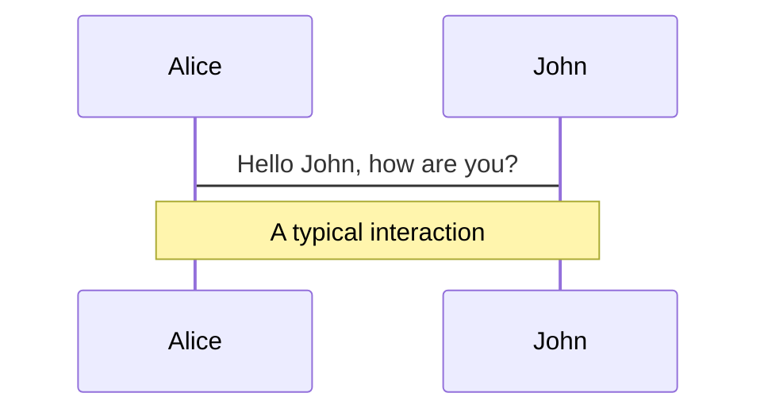
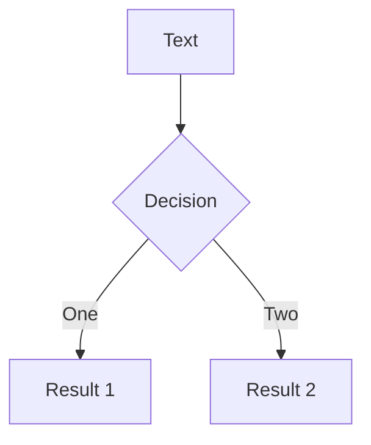
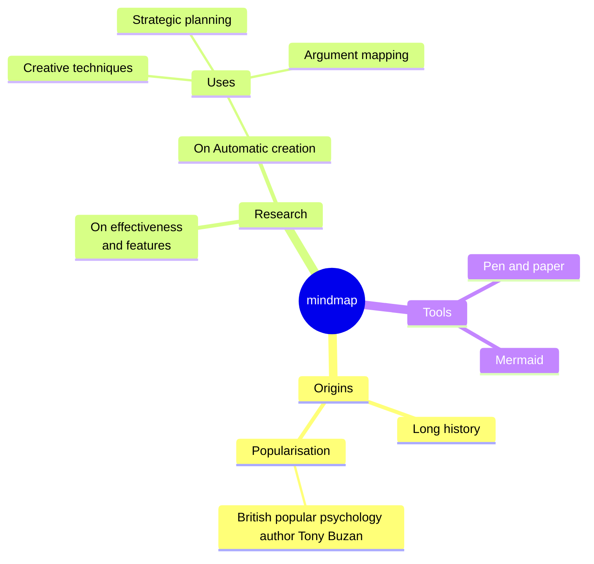
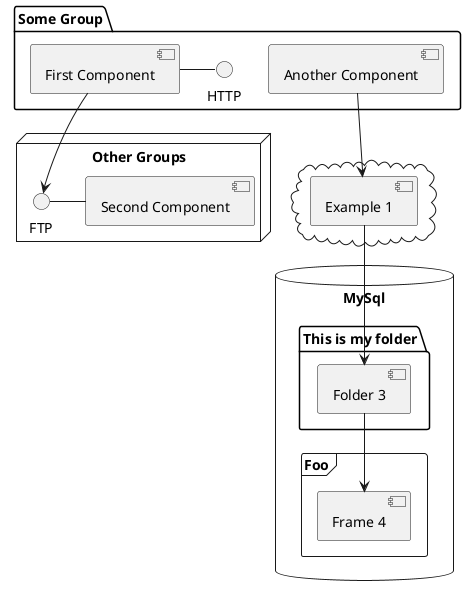

<div class="grid grid-cols-2 gap-8 items-center">
<div class="text-left">

# ZKP and<br/>Taiwan Citizen Digital Certificate

<br/>
<span class="text-white">Vivian (Ya-wen) Jeng</span>

</div>
<div class="flex flex-col items-center">
  
  <a href="https://linktr.ee/vivianjeng" target="_blank" class="mt-2 opacity-75">linktr.ee/vivianjeng</a>
</div>
</div>

<div class="abs-br m-6 text-xl">
  <button @click="$slidev.nav.openInEditor()" title="Open in Editor" class="slidev-icon-btn">
    <carbon:edit />
  </button>
  <a href="https://github.com/vivianjeng/2026-ethtaipei-zkfido" target="_blank" class="slidev-icon-btn">
    <carbon:logo-github />
  </a>
</div>

---
layout: two-cols
---

<div class="h-full flex flex-col justify-center pl-16">

# About Me
###  [Vivian (Ya-wen) Jeng](https://github.com/vivianjeng)

**2021 - 2026 June**

- **Ethereum Foundation** <br/>[Privacy Stewards of Ethereum](http://pse.dev/)
- Developer and project lead
    - [MoPro](https://zkmopro.org/) (Mobile Prover)
    - [UniRep](https://developer.unirep.io/) (Universal Reputation)

</div>

::right::

<div class="h-full flex items-center justify-center">
  
</div>


---
layout: image-right
image: /images/ptt_full.jpg
---

# Background

- 批踢踢實業坊(PTT): https://www.ptt.cc/bbs/index.html
<div class="flex flex-col gap-4 mt-6 text-sm">
  <div v-click.fade-in class="flex gap-3 items-start p-3 rounded border border-primary/20 bg-primary/10">
    <div>
      <div class="opacity-75">In 1995 <br/>— before social media existed —<br/> it was built by students</div>
    </div>
  </div>
  <div v-click.fade-in class="flex gap-3 items-start p-3 rounded border border-primary/30 bg-primary/15">
    <div>
      <div class="opacity-75">Approximately <b>30,000</b> daily active users</div>
    </div>
  </div>
  <div v-click.fade-in class="flex gap-3 items-start p-3 rounded border border-primary/40 bg-primary/20">
    <div>
      <div class="opacity-75">Non-profitable social media</div>
    </div>
  </div>
  <div v-click.fade-in class="flex gap-3 items-start p-3 rounded border border-primary/40 bg-primary/20">
    <div>
      <div class="opacity-75">Maintained by volunteers</div>
    </div>
  </div>
</div>

<style>
.slidev-layout.default + div {
  background-position: right center !important;
}
</style>


---
layout: two-cols
layoutClass: gap-8
---

# Problem

<div class="mt-6">
  <h2 class="text-lg font-semibold leading-tight flex items-center gap-2"><carbon:warning-alt class="text-yellow-400 text-xl" /> School email registration</h2>
  <div class="flex flex-col gap-3 mt-4">
    <div v-click class="bg-white/10 backdrop-blur rounded-xl border border-white/20 p-4 flex items-center gap-4">
      <carbon:user-multiple class="text-3xl text-red-400 shrink-0" />
      <div class="text-base">Previously targeted by hackers who <b>mass-registered accounts</b></div>
    </div>
    <div v-click class="bg-white/10 backdrop-blur rounded-xl border border-white/20 p-4 flex items-center gap-4">
      <carbon:bullhorn class="text-3xl text-red-400 shrink-0" />
      <div class="text-base">Also subject to <b>opinion manipulation and troll armies</b></div>
    </div>
  </div>
</div>

::right::

# Previous solution

<div class="mt-6">
  <h2 v-click class="text-lg font-semibold leading-tight flex items-center gap-2"><carbon:reset class="text-blue-400 text-xl" /> AOTP: Reverse OTP</h2>
  <div class="flex flex-col gap-3 mt-4">
    <div v-click class="bg-white/10 backdrop-blur rounded-xl border border-white/20 p-3">
      <div class="text-sm opacity-60 mb-1.5">Traditional OTP</div>
      <div class="flex items-center gap-2 text-sm flex-wrap">
        <span class="inline-flex items-center gap-1.5 whitespace-nowrap"><carbon:email class="text-xl shrink-0" /> Telecom sends SMS</span>
        <carbon:arrow-right class="shrink-0 opacity-50" />
        <span class="inline-flex items-center gap-1.5 whitespace-nowrap"><carbon:password class="text-xl shrink-0" /> User enters it on the platform</span>
      </div>
    </div>
    <div v-click class="bg-white/10 backdrop-blur rounded-xl border border-white/20 p-3">
      <div class="text-sm opacity-60 mb-1.5">AOTP</div>
      <div class="flex items-center gap-2 text-sm flex-wrap">
        <span class="inline-flex items-center gap-1.5 whitespace-nowrap"><carbon:security class="text-xl shrink-0" /> Platform displays a code</span>
        <carbon:arrow-right class="shrink-0 opacity-50" />
        <span class="inline-flex items-center gap-1.5 whitespace-nowrap"><carbon:mobile class="text-xl shrink-0" /> User sends it via SMS</span>
      </div>
    </div>
  </div>
  <div v-click class="absolute left-14 right-14 bottom-14 flex justify-center">
    
  </div>
</div>

<style>
.slidev-vclick-target {
  transition: opacity 400ms ease, transform 400ms ease;
}
.slidev-vclick-hidden {
  opacity: 0;
  transform: translateY(16px);
}
</style>

---
layout: center
---

# Why ZK?

---
layout: two-cols
---

# Cost

<div class="flex flex-col gap-3 mt-5">
  <div v-click class="bg-white/10 backdrop-blur rounded-xl border border-white/20 p-4 flex items-center gap-4">
    <carbon:chart-line class="text-2xl text-red-400 shrink-0" />
    <div class="text-base">As a non-profit, more users means <b>higher costs, not more revenue</b></div>
  </div>
  <div v-click class="bg-white/10 backdrop-blur rounded-xl border border-white/20 p-4 flex items-center gap-4">
    <carbon:security class="text-2xl text-red-400 shrink-0" />
    <div class="text-base">Carries the <b>security risk of data breaches</b></div>
  </div>

</div>

::right::

# Privacy

<div class="flex flex-col gap-3 mt-5">
  <div v-click class="bg-white/10 backdrop-blur rounded-xl border border-white/20 p-4 flex items-center gap-4">
    <carbon:police class="text-2xl text-red-400 shrink-0" />
    <div class="text-base">When fraud or crime happens on the platform, the platform is required to <b>cooperate with investigations</b></div>
  </div>
  <div v-click class="bg-white/10 backdrop-blur rounded-xl border border-white/20 p-4 flex items-center gap-4">
    <carbon:warning-alt class="text-2xl text-red-400 shrink-0" />
    <div class="text-base">Complying means <b>handing over user data</b> — eroding user trust</div>
  </div>
</div>


<div class="absolute left-14 right-14 bottom-8 flex flex-col items-center gap-3">
  <div v-click class="flex justify-center w-full quote-reveal">
    <div class="quote-box max-w-3xl text-center rounded-xl border-2 p-6" style="border-color: var(--slidev-theme-primary); background: color-mix(in srgb, var(--slidev-theme-primary) 15%, transparent);">
      <p class="text-l italic leading-relaxed" style="color: var(--slidev-theme-primary);">"PTT only needs users to prove they're Taiwanese —<br/> it doesn't need to know who they are."</p>
    </div>
  </div>

  <div v-click class="text-center text-base opacity-70">
    This is exactly the use case <b>Zero-Knowledge Proofs</b> are perfect for<br/>PTT wouldn't need to rely on telecoms, nor store users' personal data
  </div>
</div>

<style>
.slidev-vclick-target {
  transition: opacity 400ms ease, transform 400ms ease;
}
.slidev-vclick-hidden {
  opacity: 0;
  transform: translateY(16px);
}
.quote-reveal.slidev-vclick-hidden {
  opacity: 0;
  transform: scale(0.7) rotate(-4deg) translateY(30px);
  filter: blur(6px);
}
.quote-reveal.slidev-vclick-target {
  transition: opacity 700ms ease, transform 700ms cubic-bezier(0.34, 1.56, 0.64, 1), filter 700ms ease;
}
.quote-reveal:not(.slidev-vclick-hidden) .quote-box {
  animation: quote-glow 2.4s ease-in-out infinite;
}
@keyframes quote-glow {
  0%, 100% { box-shadow: 0 0 0px 0px color-mix(in srgb, var(--slidev-theme-primary) 45%, transparent); }
  50% { box-shadow: 0 0 28px 6px color-mix(in srgb, var(--slidev-theme-primary) 45%, transparent); }
}
</style>

---

# ZK stack

<div class="grid grid-cols-2 gap-10 mt-6 divide-x divide-white/10">
<div class="pr-2">

<h2 class="text-xl font-semibold flex items-center gap-2"><carbon:certificate class="text-blue-400" /> <a href="https://github.com/privacy-ethereum/zkID" target="_blank">zkID</a></h2>

<div class="flex flex-col gap-3 mt-5">
  <div v-click class="bg-white/10 backdrop-blur rounded-xl border border-white/20 p-3 flex items-center gap-3">
    <carbon:certificate class="text-2xl text-blue-400 shrink-0" />
    <div class="text-base">In 2025, the zkID team published a paper introducing the <a href="https://eprint.iacr.org/2026/251.pdf" target="_blank"><b>OpenAC</b></a> mechanism</div>
  </div>
  <div v-click class="bg-white/10 backdrop-blur rounded-xl border border-white/20 p-3 flex items-center gap-3">
    <carbon:code class="text-2xl text-blue-400 shrink-0" />
    <div class="text-base"><a href="https://github.com/privacy-ethereum/zkID" target="_blank">Open-sources</a> the <a href="https://github.com/therealyingtong/Spartan2" target="_blank"><b>Spartan + Hyrax</b> Prover</a>, the core engine used to generate ZK proofs</div>
  </div>
  <div v-click class="bg-white/10 backdrop-blur rounded-xl border border-white/20 p-3 flex items-center gap-3">
    <carbon:unlocked class="text-2xl text-blue-400 shrink-0" />
    <div class="text-base">No <b>trusted setup</b> required, and integrates with the widely-used circom frontend</div>
  </div>
  <div v-click class="bg-white/10 backdrop-blur rounded-xl border border-white/20 p-3 flex items-center gap-3">
    <carbon:rocket class="text-2xl text-blue-400 shrink-0" />
    <div class="text-base">Excellent <b class="text-emerald-600">cross-platform</b> proving performance</div>
  </div>
</div>

</div>
<div class="pl-8">

<h2 class="text-xl font-semibold flex items-center gap-2"><carbon:mobile class="text-orange-400" /> <a href="https://github.com/zkmopro/mopro" target="_blank">mopro</a></h2>

<div class="flex flex-col gap-3 mt-5">
  <div v-click class="bg-white/10 backdrop-blur rounded-xl border border-white/20 p-3 flex items-center gap-3">
    <carbon:api class="text-2xl text-orange-400 shrink-0" />
    <div class="text-base">Provides <a href="https://zkmopro.org/docs/setup/rust-setup#-customize-the-bindings" target="_blank">customizable FFI</a>, with built-in support for <b>circom, halo2, noir</b></div>
  </div>
  <div v-click class="bg-white/10 backdrop-blur rounded-xl border border-white/20 p-3 flex items-center gap-3">
    <carbon:box class="text-2xl text-orange-400 shrink-0" />
    <div class="text-base">Freely import any Rust crate in <code>Cargo.toml</code> — integrating Spartan + Hyrax works just as well</div>
  </div>
  <div v-click class="bg-white/10 backdrop-blur rounded-xl border border-white/20 p-3 flex items-center gap-3">
    <carbon:devices class="text-2xl text-orange-400 shrink-0" />
    <div class="text-base"><a href="https://mozilla.github.io/uniffi-rs/latest/" target="_blank"><b>UniFFI</b></a> + <a href="https://crates.io/crates/mopro-cli" target="_blank">mopro CLI</a> auto-generate Swift / Kotlin / React Native / Flutter bindings</div>
  </div>
  <div v-click class="bg-white/10 backdrop-blur rounded-xl border border-white/20 p-3 flex items-center gap-3">
    <carbon:tools class="text-2xl text-orange-400 shrink-0" />
    <div class="text-base">Developers <b>no longer need to rewrite the Prover</b> for every language</div>
  </div>
</div>

</div>
</div>

<style>
.slidev-vclick-target {
  transition: opacity 400ms ease, transform 400ms ease;
}
.slidev-vclick-hidden {
  opacity: 0;
  transform: translateY(16px);
}
</style>

---

# Taiwan Citizen Digital Certificate

<div class="mt-2">
  <span class="text-sm px-3 py-1 rounded-full border" style="border-color: var(--slidev-theme-primary); color: var(--slidev-theme-primary);">X.509 Certificate · Supports both computer and mobile verification</span>
</div>

<!-- <div class="flex justify-center">
  
</div> -->

| Comparison | **Citizen Digital Certificate** | Passport | Digital Credential Wallet |
| --- | --- | --- | --- |
| Adoption | ~17–20% (4.18M active) | <span class="win">✅ ~60% (14M people)</span> | Early rollout, low coverage |
| Legal validity|<span class="win">✅ Legally binding — usable for e-signatures & gov services</span> | Travel document only, not for e-signing | Still evolving, unclear status |
| Revocability | <span class="win">✅ Real-time revocation check (CRL/OCSP), fast reissue</span> | 10-year validity, chip data not updated live | Depends on wallet's own update mechanism |
| Cross-platform| <span class="win">✅ Works with computer alone or mobile alone</span> | Needs phone + NFC scan | Needs a phone app | 
| User experience| <span class="win">✅ FIDO2 biometrics on mobile — no card, no password</span> | Physical passport + NFC tap | App-guided setup, unproven at scale|

<style>
.win {
  color:rgb(49, 101, 80);
  background: rgba(74, 222, 128, 0.28);
  padding: 2px 8px;
  border-radius: 6px;
  font-weight: 800;
}

table {
  width: 100%;
  margin-top: 1.5rem;
  border-collapse: collapse;
  font-size: 1rem;
}
th, td {
  padding: 10px 12px;
  text-align: left;
  vertical-align: top;
}
thead th {
  font-size: 0.8rem;
  text-transform: uppercase;
  letter-spacing: 0.05em;
  opacity: 0.6;
  font-weight: 600;
  border-bottom: 2px solid rgba(255, 255, 255, 0.2);
}
tbody td {
  border-bottom: 1px solid rgba(255, 255, 255, 0.08);
}
tbody tr:last-child td {
  border-bottom: none;
}
tbody tr:nth-child(even) {
  background: rgba(255, 255, 255, 0.03);
}
th:nth-child(2), td:nth-child(2) {
  background: color-mix(in srgb, var(--slidev-theme-primary) 10%, transparent);
  border-left: 1px solid var(--slidev-theme-primary);
  border-right: 1px solid var(--slidev-theme-primary);
}
</style>

---
layout: center
---

# ZK Circuit Design

---


# Verifying RSA Signatures

<div
  v-motion
  :initial="{ opacity: 0.7 }"
  :enter="{ opacity: 0.7 }"
  :click-1="{ opacity: 0 }"
  class="text-center mt-2 text-xl"
>PKCS#1 v1.5 signature: RSA signature algorithm paired with SHA-256 hashing</div>

<div class="flex justify-center mt-6">
  <div
    v-motion
    :initial="{ scale: 1, y: 0 }"
    :enter="{ scale: 1, y: 0 }"
    :click-1="{ scale: 0.5, y: -100 }"
    class="rounded-xl border-2 px-8 py-10 text-center"
    style="border-color: var(--slidev-theme-primary); background: color-mix(in srgb, var(--slidev-theme-primary) 10%, transparent); font-size: 1.25rem;"
  >

$$\underbrace{{\mathrm{signature}^{\,65537}}}_{\text{RSA signature}} \bmod \underbrace{n}_{\text{RSA modulus}} = \mathrm{Encoded\ Message}\Big(\mathrm{SHA{\text -}256}\big(\underbrace{M}_{\text{message to verify}}\big)\Big)$$

  </div>
</div>

<div
  v-motion
  :initial="{ opacity: 0.6 }"
  :enter="{ opacity: 0.6 }"
  :click-1="{ opacity: 0 }"
  class="text-center text-lg mt-2"
>e = 65537: fixed public exponent, the same for both government certificates and user signatures</div>

<div class="grid grid-rows-2 gap-3 mt-3 relative">
  <div 
    v-click="1" 
    v-motion
    :click-1="{ y: -185 }"
    class="bg-blue-400/10 backdrop-blur rounded-xl border-2 border-blue-400/40 p-4">
    <div class="flex items-center gap-1 ">
      <carbon:certificate-check class="text-xl text-blue-400 shrink-0" />
      <span class="text-base font-bold">Verify government signature</span>
    </div>
    <div class="text-sm mt-2 font-semibold text-green-600">Proves the Citizen Digital Certificate was issued by the government</div>
    <div class="font-mono text-sm mt-3 flex flex-col gap-1.5">
      <div>n = n<sub>issuer</sub> (2048 / 4096-bit) — Ministry of the Interior's public key</div>
      <div>M = M<sub>cert</sub> (the user's X.509 certificate)</div>
    </div>
  </div>
  <div 
    v-click="2"
    v-motion
    :click-1="{ y: -185 }"
    class="bg-orange-400/10 backdrop-blur rounded-xl border-2 border-orange-400/40 p-4">
    <div class="flex items-center gap-1">
      <carbon:checkmark-filled class="text-xl text-orange-400 shrink-0" />
      <span class="text-base font-bold">Verify user signature</span>
    </div>
    <div class="text-sm mt-2 font-semibold text-green-600">Ensures the user owns the certificate</div>
    <div class="font-mono text-sm mt-3 flex flex-col gap-1.5">
      <div>n = n<sub>user</sub> (2048-bit) — the user's public key</div>
      <div>M = designated message (provided by the platform)</div>
    </div>
  </div>
</div>

<style>
.slidev-vclick-target {
  transition: opacity 400ms ease, transform 400ms ease;
}
.slidev-vclick-hidden {
  opacity: 0;
  transform: translateY(16px);
}
</style>


---

# ZK Circuit: Verification Flow

<div class="flex items-start justify-center mt-12">
  <div class="relative flex flex-col gap-3 text-l text-right mt-18 pl-10">
    <div class="flex items-center justify-end text-blue-400">*Issuer RSA public key <span class="arrow-line w-28 ml-2 -mr-6"></span></div>
    <div class="flex items-center justify-end text-gray-500">Issuer RSA signature <span class="arrow-line w-28 ml-2 -mr-6"></span></div>
    <div class="flex items-center justify-end text-gray-500"><span v-motion class="rounded-full px-2 py-0.5 border-2" :initial="{ color: '#6b7280', borderColor: 'transparent' }" :enter="{ color: '#6b7280', borderColor: 'transparent' }" :click-2="{ color: '#ef4444', borderColor: '#ef4444' }">User X.509 cert (TBS)</span> <span class="arrow-line w-28 ml-2 -mr-6"></span></div>
    <div class="flex items-center justify-end py-4"></div>
    <div class="flex items-center justify-end text-gray-500"><span v-motion class="rounded-full px-2 py-0.5 border-2" :initial="{ color: '#6b7280', borderColor: 'transparent' }" :enter="{ color: '#6b7280', borderColor: 'transparent' }" :click-2="{ color: '#ef4444', borderColor: '#ef4444' }">User RSA public key</span> <span class="arrow-line w-28 ml-2 -mr-6"></span></div>
    <div class="flex items-center justify-end text-gray-500">User RSA signature <span class="arrow-line w-28 ml-2 -mr-6"></span></div>
    <div class="flex items-center justify-end text-blue-400">*Message (TBS) <span class="arrow-line w-28 ml-2 -mr-6"></span></div>
    <svg class="absolute pointer-events-none" style="left: 0.5rem; top: 32%; width: 1.75rem; height: 38%;" viewBox="0 0 40 100" preserveAspectRatio="none">
      <defs>
        <marker id="arrowContains" viewBox="0 0 10 10" refX="9" refY="5" markerWidth="6" markerHeight="6" orient="auto-start-reverse"><path d="M0,0 L10,5 L0,10 z" fill="#f87171" /></marker>
      </defs>
      <path d="M 32 0 C 5 20, 5 80, 32 100" fill="none" stroke="#f87171" stroke-width="2.5" stroke-dasharray="5 4" marker-end="url(#arrowContains)" />
    </svg>
  </div>
  <div class="flex flex-col items-center">
    <div class="text-xl tracking-[0.3em] text-gray-700 mb-3">ZK PROGRAM</div>
    <div class="border-2 border-dashed border-gray-700 rounded-xl p-6 flex flex-col gap-6">
      <div class="border-2 border-slate-500 bg-slate-300/60 rounded-lg px-8 py-10 text-center font-bold">verifies RSA signature</div>
      <div class="py-2"></div>
      <div class="border-2 border-slate-500 bg-slate-300/60 rounded-lg px-8 py-10 text-center font-bold">verifies RSA signature</div>
    </div>
  </div>
  <div class="relative flex items-center self-center mt-10 text-gray-500">
    <span class="arrow-line w-20"></span>
    <div class="border-2 border-amber-500 bg-amber-100/60 rounded-lg px-8 py-8 text-center font-bold text-amber-700">ZK Proof</div>
  </div>
  <div v-click="1" class="absolute inset-0 flex items-center justify-center translate-y-15 translate-x-5">
    <div class="border-2 border-red-400 bg-red-50 text-red-600 rounded-full px-5 py-3 text-l font-semibold text-center">How do we ensure these two signatures are linked?</div>
  </div>
  <div v-click="2" class="hidden"></div>
</div>
<style>
.arrow-line {
  position: relative;
  display: inline-block;
  height: 2px;
  background: currentColor;
}
.arrow-line::after {
  content: '';
  position: absolute;
  right: -1px;
  top: 50%;
  transform: translateY(-50%);
  border-style: solid;
  border-width: 5px 0 5px 8px;
  border-color: transparent transparent transparent currentColor;
}
</style>

---
transition: fade-out
---

# What is Slidev?

Slidev is a slides maker and presenter designed for developers, consist of the following features

- 📝 **Text-based** - focus on the content with Markdown, and then style them later
- 🎨 **Themable** - themes can be shared and re-used as npm packages
- 🧑‍💻 **Developer Friendly** - code highlighting, live coding with autocompletion
- 🤹 **Interactive** - embed Vue components to enhance your expressions
- 🎥 **Recording** - built-in recording and camera view
- 📤 **Portable** - export to PDF, PPTX, PNGs, or even a hostable SPA
- 🛠 **Hackable** - virtually anything that's possible on a webpage is possible in Slidev
<br>
<br>

Read more about [Why Slidev?](https://sli.dev/guide/why)

<!--
You can have `style` tag in markdown to override the style for the current page.
Learn more: https://sli.dev/features/slide-scope-style
-->

<style>
h1 {
  background-color: #2B90B6;
  background-image: linear-gradient(45deg, #4EC5D4 10%, #146b8c 20%);
  background-size: 100%;
  -webkit-background-clip: text;
  -moz-background-clip: text;
  -webkit-text-fill-color: transparent;
  -moz-text-fill-color: transparent;
}
</style>

<!--
Here is another comment.
-->

---
transition: slide-up
level: 2
---

# Navigation

Hover on the bottom-left corner to see the navigation's controls panel, [learn more](https://sli.dev/guide/ui#navigation-bar)

## Keyboard Shortcuts

|                                                     |                             |
| --------------------------------------------------- | --------------------------- |
| <kbd>right</kbd> / <kbd>space</kbd>                 | next animation or slide     |
| <kbd>left</kbd>  / <kbd>shift</kbd><kbd>space</kbd> | previous animation or slide |
| <kbd>up</kbd>                                       | previous slide              |
| <kbd>down</kbd>                                     | next slide                  |

<!-- https://sli.dev/guide/animations.html#click-animation -->

<p v-after class="absolute bottom-23 left-45 opacity-30 transform -rotate-10">Here!</p>

---
layout: two-cols
layoutClass: gap-16
---

# Table of contents

You can use the `Toc` component to generate a table of contents for your slides:

```html
<Toc minDepth="1" maxDepth="1" />
```

The title will be inferred from your slide content, or you can override it with `title` and `level` in your frontmatter.

::right::

<Toc text-sm minDepth="1" maxDepth="2" />

---
layout: image-right
image: https://cover.sli.dev
---

# Code

Use code snippets and get the highlighting directly, and even types hover!

```ts [filename-example.ts] {all|4|6|6-7|9|all} twoslash
// TwoSlash enables TypeScript hover information
// and errors in markdown code blocks
// More at https://shiki.style/packages/twoslash
import { computed, ref } from 'vue'

const count = ref(0)
const doubled = computed(() => count.value * 2)

doubled.value = 2
```

<arrow v-click="[4, 5]" x1="350" y1="310" x2="195" y2="342" color="#953" width="2" arrowSize="1" />

<!-- This allow you to embed external code blocks -->
<<< @/snippets/external.ts#snippet

<!-- Footer -->

[Learn more](https://sli.dev/features/line-highlighting)

<!-- Inline style -->
<style>
.footnotes-sep {
  @apply mt-5 opacity-10;
}
.footnotes {
  @apply text-sm opacity-75;
}
.footnote-backref {
  display: none;
}
</style>

<!--
Notes can also sync with clicks

[click] This will be highlighted after the first click

[click] Highlighted with `count = ref(0)`

[click:3] Last click (skip two clicks)
-->

---
level: 2
---

# Shiki Magic Move

Powered by [shiki-magic-move](https://shiki-magic-move.netlify.app/), Slidev supports animations across multiple code snippets.

Add multiple code blocks and wrap them with <code>````md magic-move</code> (four backticks) to enable the magic move. For example:

````md magic-move {lines: true}
```ts {*|2|*}
// step 1
const author = reactive({
  name: 'John Doe',
  books: [
    'Vue 2 - Advanced Guide',
    'Vue 3 - Basic Guide',
    'Vue 4 - The Mystery'
  ]
})
```

```ts {*|1-2|3-4|3-4,8}
// step 2
export default {
  data() {
    return {
      author: {
        name: 'John Doe',
        books: [
          'Vue 2 - Advanced Guide',
          'Vue 3 - Basic Guide',
          'Vue 4 - The Mystery'
        ]
      }
    }
  }
}
```

```ts
// step 3
export default {
  data: () => ({
    author: {
      name: 'John Doe',
      books: [
        'Vue 2 - Advanced Guide',
        'Vue 3 - Basic Guide',
        'Vue 4 - The Mystery'
      ]
    }
  })
}
```

Non-code blocks are ignored.

```vue
<!-- step 4 -->
<script setup>
const author = {
  name: 'John Doe',
  books: [
    'Vue 2 - Advanced Guide',
    'Vue 3 - Basic Guide',
    'Vue 4 - The Mystery'
  ]
}
</script>
```
````

---

# Components

<div grid="~ cols-2 gap-4">
<div>

You can use Vue components directly inside your slides.

We have provided a few built-in components like `<Tweet/>`, `<BlueSky/>`, and `<Youtube/>` that you can use directly. And adding your custom components is also super easy.

```html
<Counter :count="10" />
```

<!-- ./components/Counter.vue -->
<Counter :count="10" m="t-4" />

Check out [the guides](https://sli.dev/builtin/components.html) for more.

</div>
<div>

```html
<Tweet id="1390115482657726468" />
```

<Tweet id="1390115482657726468" scale="0.65" />

</div>
</div>

<!--
Presenter note with **bold**, *italic*, and ~~striked~~ text.

Also, HTML elements are valid:
<div class="flex w-full">
  <span style="flex-grow: 1;">Left content</span>
  <span>Right content</span>
</div>
-->

---
class: px-20
---

# Themes

Slidev comes with powerful theming support. Themes can provide styles, layouts, components, or even configurations for tools. Switching between themes by just **one edit** in your frontmatter:

<div grid="~ cols-2 gap-2" m="t-2">

```yaml
---
theme: default
---
```

```yaml
---
theme: seriph
---
```


</div>

Read more about [How to use a theme](https://sli.dev/guide/theme-addon#use-theme) and
check out the [Awesome Themes Gallery](https://sli.dev/resources/theme-gallery).

---

# Clicks Animations

You can add `v-click` to elements to add a click animation.

<div v-click>

This shows up when you press <kbd>space</kbd> or <kbd>right</kbd>, or click outside the slide on the right.

```html
<div v-click>This shows up when you trigger a click animation.</div>
```

</div>

<p v-click>
You can also add modifiers to change the animation:
</p>

<div class="grid gap-3 mt-4 text-sm" style="grid-template-columns: repeat(3, 1fr) 1.5fr 1fr">
  <div v-after.up class="p-3 rounded border border-primary/20 bg-primary/10">
    <div class="font-mono text-xs opacity-60 mb-1">v-click.up</div>
    <div>Slide from bottom</div>
  </div>
  <div v-click.fade-in class="p-3 rounded border border-primary/30 bg-primary/15">
    <div class="font-mono text-xs opacity-60 mb-1">v-click.fade-in</div>
    <div>Fade in</div>
  </div>
  <div v-click.fade class="p-3 rounded border border-primary/40 bg-primary/20">
    <div class="font-mono text-xs opacity-60 mb-1">v-click.fade</div>
    <div>Dim (0.5 opacity)</div>
  </div>
  <div v-click.fade.right.scale class="p-3 rounded border border-primary/50 bg-primary/25">
    <div class="font-mono text-xs opacity-60 mb-1">v-click.fade.right.scale</div>
    <div>Composed</div>
  </div>
  <div v-click.none class="p-3 rounded border border-primary/60 bg-primary/30">
    <div class="font-mono text-xs opacity-60 mb-1">v-click.none</div>
    <div>No transition</div>
  </div>
</div>

<v-click>

The <span v-mark.red="7"><code>v-mark</code> directive</span>
also allows you to add
<span v-mark.circle.orange="8">inline marks</span>
, powered by [Rough Notation](https://roughnotation.com/):

```html
<span v-mark.underline.orange>inline markers</span>
```

</v-click>

<div v-click mt-12>

[Learn more](https://sli.dev/guide/animations#click-animation)

</div>

---

# Motions

Motion animations are powered by [@vueuse/motion](https://motion.vueuse.org/), triggered by `v-motion` directive.

```html
<div
  v-motion
  :initial="{ x: -80 }"
  :enter="{ x: 0 }"
  :click-3="{ x: 80 }"
  :leave="{ x: 1000 }"
>
  Slidev
</div>
```

<div class="w-60 relative">
  <div class="relative w-40 h-40">
    
    
    
  </div>

  <div
    class="text-5xl absolute top-14 left-40 text-[#2B90B6] -z-1"
    v-motion
    :initial="{ x: -80, opacity: 0}"
    :enter="{ x: 0, opacity: 1, transition: { delay: 2000, duration: 1000 } }">
    Slidev
  </div>
</div>

<!-- vue script setup scripts can be directly used in markdown, and will only affects current page -->
<script setup lang="ts">
const final = {
  x: 0,
  y: 0,
  rotate: 0,
  scale: 1,
  transition: {
    type: 'spring',
    damping: 10,
    stiffness: 20,
    mass: 2
  }
}
</script>

<div
  v-motion
  :initial="{ x:35, y: 30, opacity: 0}"
  :enter="{ y: 0, opacity: 1, transition: { delay: 3500 } }">

[Learn more](https://sli.dev/guide/animations.html#motion)

</div>

---

# $\LaTeX$

$\LaTeX$ is supported out-of-box. Powered by [$\KaTeX$](https://katex.org/).

<div h-3 />

Inline $\sqrt{3x-1}+(1+x)^2$

Block
$$ {1|3|all}
\begin{aligned}
\nabla \cdot \vec{E} &= \frac{\rho}{\varepsilon_0} \\
\nabla \cdot \vec{B} &= 0 \\
\nabla \times \vec{E} &= -\frac{\partial\vec{B}}{\partial t} \\
\nabla \times \vec{B} &= \mu_0\vec{J} + \mu_0\varepsilon_0\frac{\partial\vec{E}}{\partial t}
\end{aligned}
$$

[Learn more](https://sli.dev/features/latex)

---

# Diagrams

You can create diagrams / graphs from textual descriptions, directly in your Markdown.

<div class="grid grid-cols-4 gap-5 pt-4 -mb-6">









</div>

Learn more: [Mermaid Diagrams](https://sli.dev/features/mermaid) and [PlantUML Diagrams](https://sli.dev/features/plantuml)

---
foo: bar
dragPos:
  square: 506,77,167,_,197
---

# Draggable Elements

Double-click on the draggable elements to edit their positions.

<br>

###### Directive Usage

```md

```

<br>

###### Component Usage

```md
<v-drag text-3xl>
  <div class="i-carbon:arrow-up" />
  Use the `v-drag` component to have a draggable container!
</v-drag>
```

<v-drag pos="663,206,261,_,-15">
  <div text-center text-3xl border border-main rounded>
    Double-click me!
  </div>
</v-drag>


###### Draggable Arrow

```md
<v-drag-arrow two-way />
```

<v-drag-arrow pos="67,452,253,46" two-way op70 />

---
src: ./pages/imported-slides.md
hide: false
---

---

# Monaco Editor

Slidev provides built-in Monaco Editor support.

Add `{monaco}` to the code block to turn it into an editor:

```ts {monaco}
import { ref } from 'vue'
import { emptyArray } from './external'

const arr = ref(emptyArray(10))
```

Use `{monaco-run}` to create an editor that can execute the code directly in the slide:

```ts {monaco-run}
import { version } from 'vue'
import { emptyArray, sayHello } from './external'

sayHello()
console.log(`vue ${version}`)
console.log(emptyArray<number>(10).reduce(fib => [...fib, fib.at(-1)! + fib.at(-2)!], [1, 1]))
```

---
layout: center
class: text-center
---

# Learn More

[Documentation](https://sli.dev) · [GitHub](https://github.com/slidevjs/slidev) · [Showcases](https://sli.dev/resources/showcases)

<PoweredBySlidev mt-10 />
